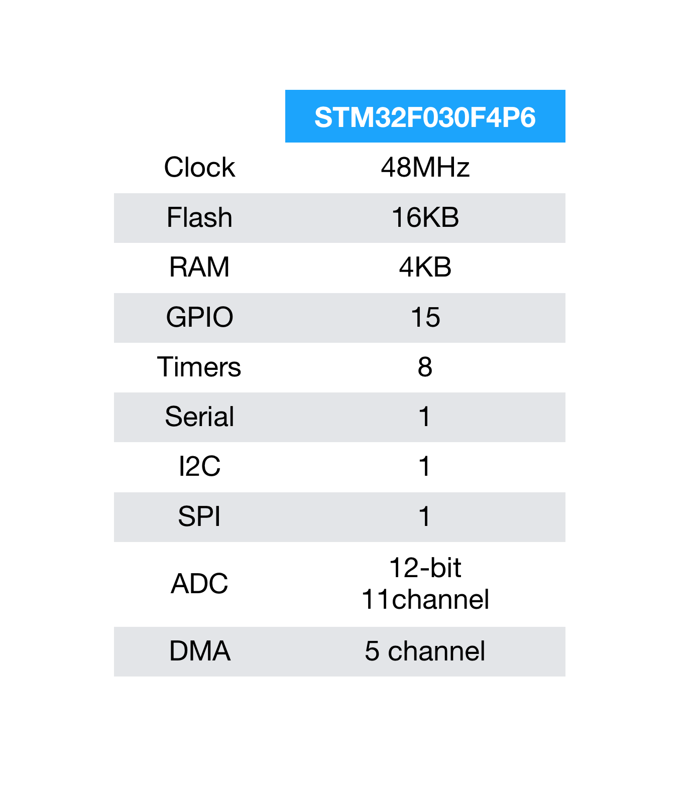
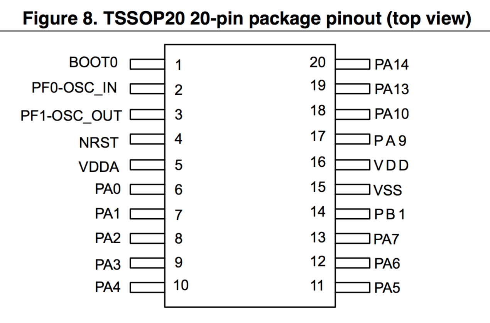
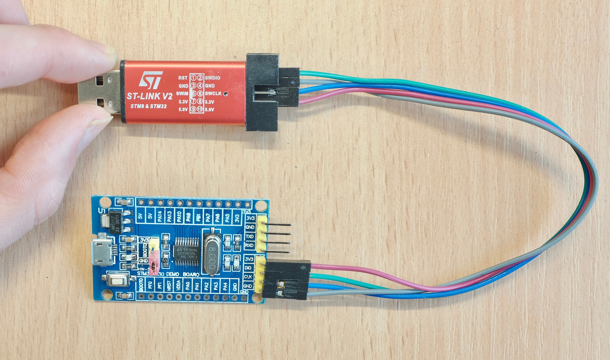
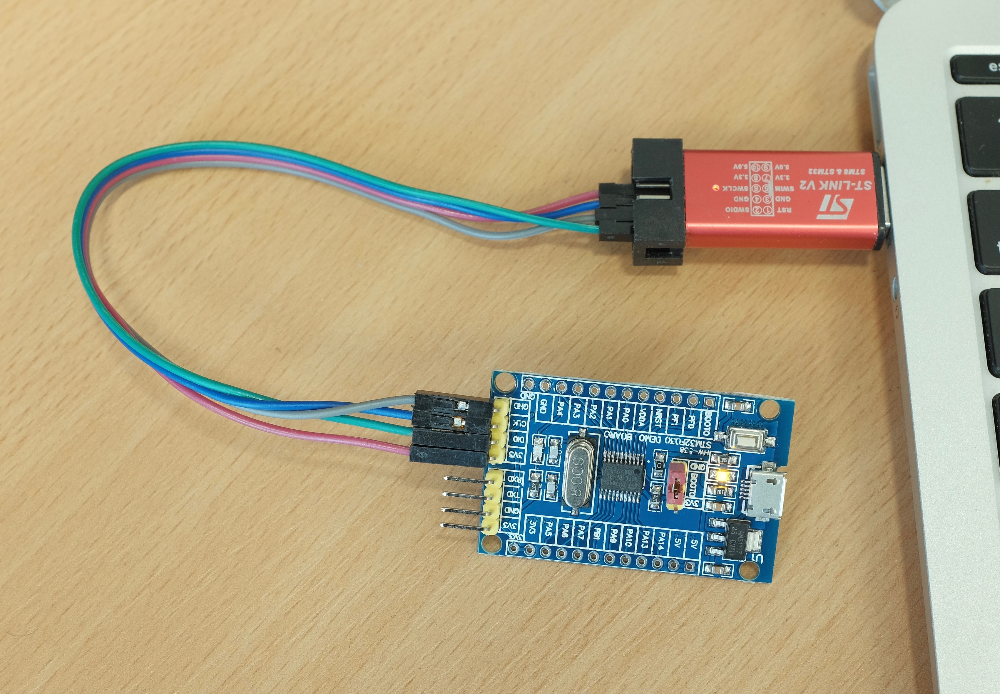
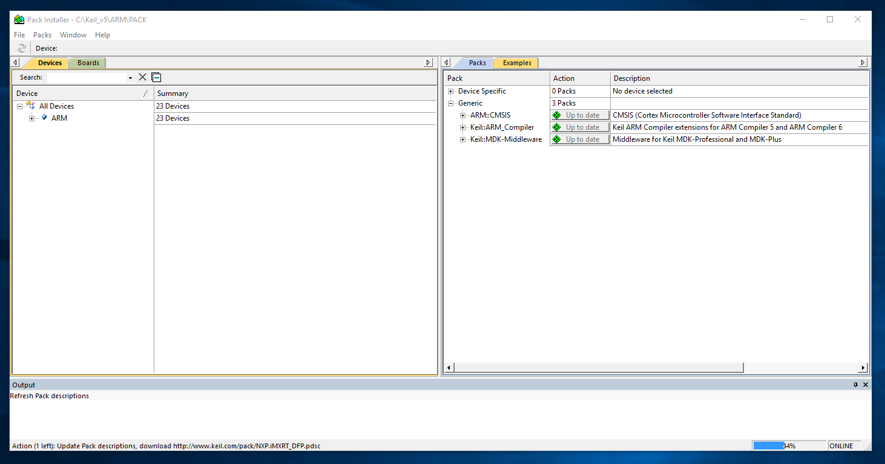
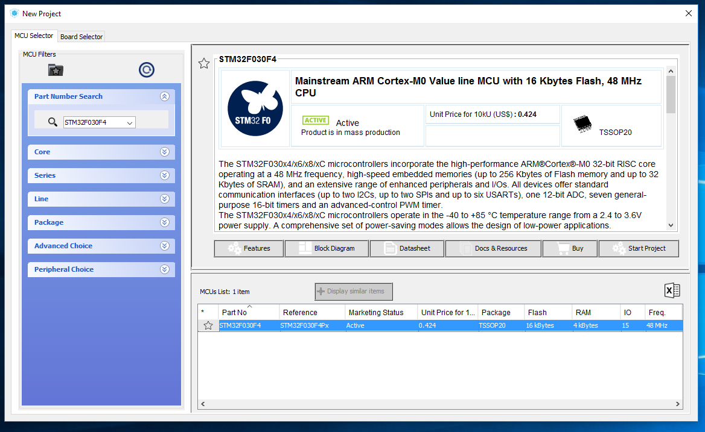
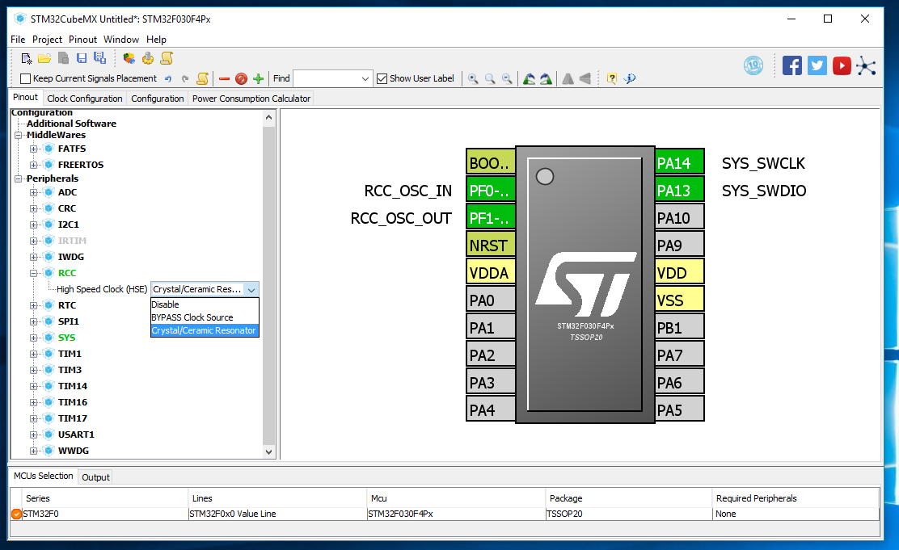
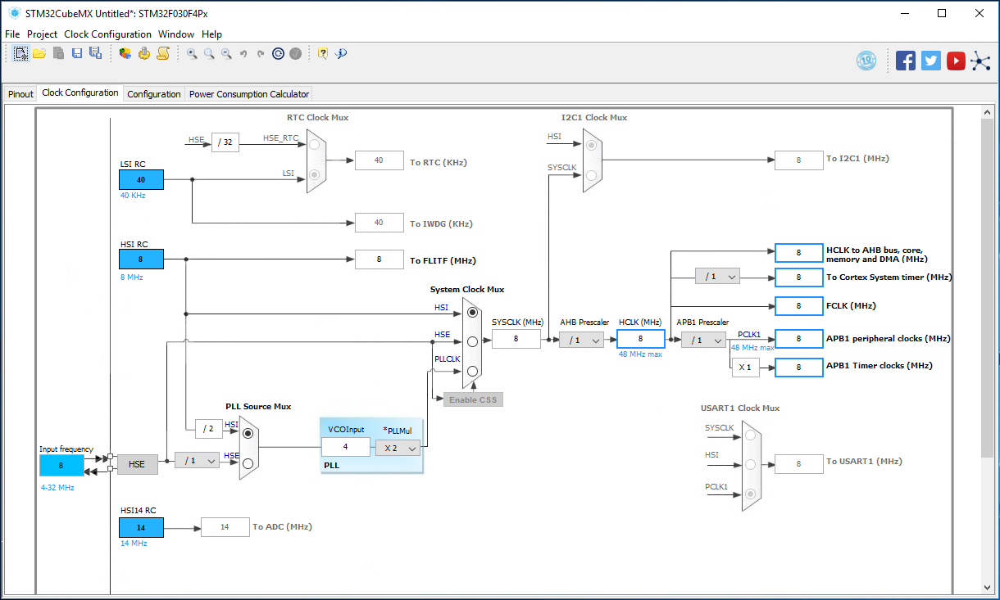
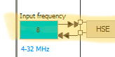
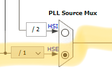

# Lesson 000: Board Detail, Softwares, and Blinking LED

Previous lesson: [Introduction and required hardwares](../README.md)

In this lesson we're going to take a detailed look at the chip and the dev board, learn how to hook it up to the programmer, install required softwares, set up the microcontroller, and finally write our very own "Blink" program!

That's quite a bit of work, and it's going to take a while. However, this is the most important lesson of them all since it walks you through the entire process in detail. And you can use it on any other STM32 variant you want once you persevere.

## The chip

We will be using the **STM32F030F4P6** chip throughout this tutorial series. Out of the hundreds of STM32 variants, this is actually the cheapest and most basic chip available. And here is its specs:

Now it might sound counterintuitive to start from the bottom of the line, but I do have some very good reasons:

* They are cheap. A single chip is 50 cents, and a compete dev board is only $1.5.

* They are simple enough for first timers to get going quickly. 

* Despite the lowly status, they are still very capable and contain all the basic peripherals we're going to cover.

* All you learned working with this chip also applies to all other STM32 chips, so you can easily step up after you're done.

Now let's take a look at the pinout of this chip, taken from [the datasheet](../resources/datasheets/stm32f030f4p6.pdf):

Unlike Arduino where pins are referred to by simply a number(pin 1, pin 2...), GPIO pins on bare microcontrollers like STM32 usually has a *port* and *number* associated with them. A *port* is a set of pins that are organized internally and can be controlled together. In STM32, GPIO ports are named alphabetically starting from A, and each port can have up to 16 pins from 0 to 15.

As a result, GPIO pins on STM32 are named like `PXY`, which stand for 'Port X pin Y'. Due to size limits not all chips will have all the ports, and not every port will have all its 16 pins. In this case, most of the pins are from port A(PA0 to PA14). Port B only has 1 pin(PB1), and Port F has 2(PF0 and PF1).

There are also some non-GPIO pins common to all STM32 chips that are worth mentioning:

| Pin name | Function                                             |
|----------|------------------------------------------------------|
| VSS      | Ground                                               |
| VDD      | 3.3V Supply                                          |
| VDDA     | Analog supply for ADC and DAC. Usually equal to VDD. |
| VBAT     | Battery input for RTC and low-power backups	      |
| NRST     | Active low reset. Pulled up internally.              |
| Boot0    | Boot mode. Low: normal startup, High: run bootloader |

That pretty much covers all you need to know for the moment. Let's move on to the dev board.

## The dev board

By now you should have all three pieces of hardwares ready: the dev board itself, the ST-Link v2 programmer, and the USB serial adapter:

Let's take a closer look at the dev board itself with added annotations:

All in all a clean, simple, and versatile little board. Something to note:

* All pins have been broken out on the header.

* The micro USB connector is for power only, since this chip doesn't have USB capability.

* All STM32 chips run at 3.3V, but are 5V tolerant on *digital* pins.

* Don't worry about the BOOT0 selector, leave it on the default GND side. (aka normal startup)

## Hookup

Now let's hook it up to the programmer so we can upload our programs into it. We're using ST's SWD debugging interface, which only require 2 wires plus power.

Plug the 4 wires into `SWDIO`, `GND`, `SWCLK` and `3.3V` pins on the programmer:

And connect the other end accordingly into the programming header on the dev board.

That's it! Hope that wasn't too hard for you. The programmer also powers the board when it's plugged in.

## Softwares

We're doing the development under Windows, as it is the easiest way to get started. Of course you can set up your own toolchain in Linux, but that is going to be later.

There are 3 softwares that you need to install, all of which free:

### STM32 ST-LINK utility

A useful utility through which you can view/wipe the flash memory, dump/upload firmwares, adjust chip settings, etc. It also contains the driver for the ST-Link programmer that you just bought.

Go to the official site:

http://www.st.com/en/development-tools/stsw-link004.html

Click the blue "get software" button at the bottom of the page:

It will then ask for your name and email. Give it some fake name and [generate a fake email](https://www.guerrillamail.com) to get the download link.

Run the installer, it will ask you to install the driver, click install.

After it's done, plug in the programmer with the board into a USB port:

If your wiring is correct, the power LED should light up. The user LED might start blinking too if the seller burned a demo program into it, which is kind of a spoiler, but let's ignore that for now.

Windows should install some drivers automatically, wait for it to finish. Then open up the STM32 ST-LINK utility you just installed, click the connect button. 

If the hookup is still correct, the memory content should now appear in the main window:

If everything works, congrats! You can move on to the next software now. There are also some tools in the `Target` menu to play with should you feel adventurous.

### STM32CubeMX

STM32CubeMX is an interactive configuration tool and code generator. It lets you set up the microcontroller in a straightforward graphical interface, then generates the initialization code so you don't have to write any. Pretty neat!

Just like the first one, go to the official link below, click the blue "Get Software" button near the bottom, and download it:

http://www.st.com/en/development-tools/stm32cubemx.html

Inside the zip there are 3 copies for different platforms. You'll want to run the windows one:

Click through with defaults. If you don't have Java it will ask you to install it. After it's all said and done, we can move on to the third and final software.

### Keil MDK-ARM

Keil is considered one of the "standard" IDEs in embedded development, it has a large community, and offers excellent compiler and debugging tools. And as you would expect, it is non-free. A license costs thousands of dollars, and a 32KB code size limit is enforced otherwise.

There is a silver lining however, as ST provides a **free license for all STM32F0 parts** with no code size limit at all. The aim is to get more people into STM32, and I guess it's working.

Anyway, F0 is more than capable for the majority if projects, you can it have up to 100 pins, 256KB flash, and 32KB of RAM. And when you do grow out of the F0 series, you can set up the open source arm-gcc compiler and get rid of the license issue all together.

Go to the offcial link below, fill in the form and download the installer. Again, use a [fake identity](http://www.fakenamegenerator.com/) to protect your privacy:

https://www.keil.com/demo/eval/arm.htm

Click through the installer with default settings. It will take a bit and install some drivers. After the installation is finished it will automatically open the "Pack Installer" and start to download some software packages. Just wait for it to finish, you can see the progress on the bottom right corner.

The lists will fill up after it's done. We can quit the program for now.

That's it! All three program installed. We're ready to actually start writing our first STM32 program now!

## The Blinky LED

The simple blinking LED is the "hello world" of embedded systems. It's probably your first Arduino program, and we're going to do it all over again with STM32. The process involves configuring the chip in STM32CubeMX, generating the initialization code, writing your own code, and compile then upload. This process is the same with any STM32 chips.

### Chip configuration in STM32CubeMX

#### Selecting the target chip

Open up STM32CubeMX and click `New Project`:

It might start to check for updates, eventually you'll end up here:

As you can see it's quite a comprehensive list, and you can browse by series, package, features, cost, etc.

We need to find which chip we're using, and since we already know the part number `STM32f030F4`, we just need to type it in the search box:

Double click the listing to select this chip:

Now we're in a nice chip configuration view! On the left side is a list of available peripherals, and on the right side is a illustration of the chip itself. You can zoom in/out using mouse wheel, move it around with left click, and rotate it with the buttons on the toolbar above to suit your needs.

We do need to configure a few peripherals, so let's begin.

#### Enable SWD

First up we need to enable SWD in order to upload the firmware into the chip. Expand `SYS` node and check the `Debug Serial Wire ` box:

You can see the PA14 and PA13 pins are automatically highlighted on the right side, indicating they are being used.

#### Enable External Clock Source

There is an external crystal oscillator on the dev board, and we're going to use that to run the chip. 

Expand RCC (Reset and Clock Control) node, select `Crystal/Ceramic Resonator` for HSE.

#### Enable GPIO Output

Finally we need to set a GPIO pin to output. We're going to use the LED that's connected to PA4 on our dev board.

*Left* click on PA4 then select `GPIO_Output`:

This sets the function of PA4 to GPIO Output, after that *right* click on PA4 again and select `Enter User Label` to give it a fancy name, I'm calling it `USER_LED`.

That's all for peripherals! We now have some heady stuff coming up.

#### A Brief Intro on STM32 Clock Signals

Before the next step, I think it would be a good idea to first get you familiar with various clock signals that STM32 utilizes, so here it goes:

##### Internal Clocks

Those clock sources are inside the chips themselves, they are always available, but generally less accurate. Members are:

| Clock | Frequency | Description                                                                                                 |
|-------|-----------|-------------------------------------------------------------------------------------------------------------|
| LSI   | ~40KHz    | Low Speed Internal. Highly unstable, avoid.|
| HSI   | 8MHz      | High Speed Internal. Can be used for system clock.                                                           |
| HSI14 | 14MHz     | Used for ADC.                                                                                                |
| HSI48 | 48MHz     | Only on USB capable chips. Can be used for system clock.                                                                               |

LSI is uncalibrated and inaccurate, avoid at all cost.

HSI and HSI48 work fine if no precise timekeeping is required, otherwise an external crystal is recommended.

##### External Clocks

You can also supply 2 clock signals externally for more accuracy:

| Clock | Frequency         | Description                                |
|-------|-------------------|--------------------------------------------|
| LSE   | Usually 32.768KHz | Low Speed External. Used for RTC timekeeping.   |
| HSE   | 4 - 32MHz         | High Speed External. Used for system clock |

A crystal oscillator is usually utilized for external clocks, as is the case with the dev board we're using.

#### Configuring the Clock Tree

We're ready for the clock tree! Click `Clock Configuration` tab:

Now this is some proper heady stuff. Don't worry though, I provided a completed set-up below. Follow the yellow path and I'll explain along the way:

We start from the very beginning of the yellow path.

We can see HSE is available since we're using an external crystal. The `input frequency` is set to 8MHz, you can change it if you're using a different crystal.

Next we encounter a clock divider. 8MHz is already pretty slow so we leave it at 1.

Next we run into the `PLL source Mux`. We use PLL(Phase Locked Loop) to multiply the input to 48MHz so the chip can run at full speed. Here we choose which clock goes into the PLL, in this case the HSE.

Here at PLL we choose how many times to multiply the input clock. We have 8MHz and want 48MHz, so 6 it is.

Now we arrive at `System Clock Mux`, which determines what to use to clock the entire system. PLL output in this case.

If your external clock is fast enough you can also skip the PLL and use HSE directly here.

Now the 48MHz system clock is being distributed to a number of system buses and peripherals. There's no need to worry about the details here, just keep everything under the max frequency and it'll be fine.

That's pretty much it! I hope it made sense. The clock tree might be more complicated on higher end STM32 chips, but the basic principle still stands.

Altertitively, this is the path you take if you want to use internal oscilatora.