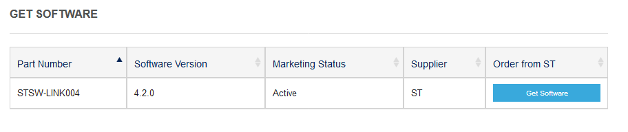
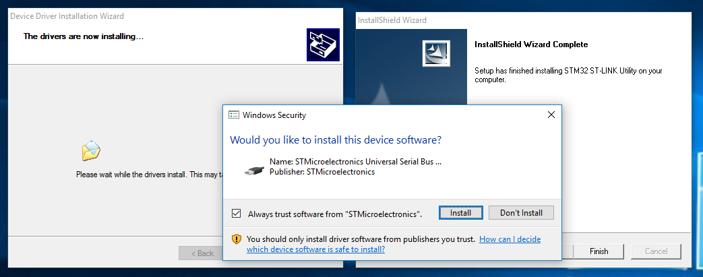
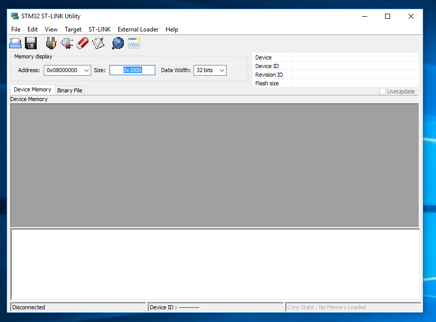
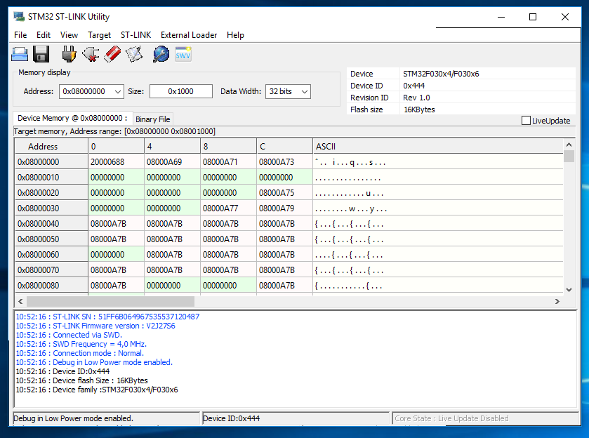

# Lesson 000: Board Detail, Softwares, and Blinking LED

In this Lesson we're going to take a look at

## Softwares

We're doing the development under Windows, as it is the easiest way to get started. Of course you can set up your own toolchain in Linux, but that is going to be later.

There are 3 softwares that you need to install, all of which free:

### STM32 ST-LINK utility

A useful utility through which you can view/wipe the flash memory, dump/upload firmwares, adjust chip settings, etc. It also contains the driver for the ST-Link programmer that you just bought.

Go to the official site:

http://www.st.com/en/development-tools/stsw-link004.html

Click the blue "get software" button at the bottom of the page:

It will then ask for your name and email. Give it some fake name and [generate a fake email](https://www.guerrillamail.com) to get the download link. Check the email and download the software from the link inside.

Run the installer, it will ask you to install the driver, click install.

After it's done, plug in the programmer with the board into a USB port. Windows should install some drivers automatically, wait for it to finish.

PHOTO HERE OF PROGRAMMER PLUGGED INTO LAPTOP

Then open up the STM32 ST-LINK utility you just installed, click the connect button. 

If your wiring is correct, the memory content should now appear in the main window:

If everything works, congrats! You can move on to the next software now. There are also some tools in the `Target` menu to play with should you feel adventurous.

### STM32CubeMX

STM32CubeMX is an interactive configuration tool and code generator. It lets you set up the microcontroller in a straightforward graphical interface, and then generates required initialization code so you don't have to write any. Pretty neat!

Just like the first one, go to the official link below, click the blue "Get Software" button near the bottom, and download it:

http://www.st.com/en/development-tools/stm32cubemx.html

Inside the zip there are 3 copies for different platforms. You'll want to run the windows one:

If you don't have Java if will ask you to install that as well. After it's all said and done, we can move on to the third and final software.

### Keil MDK-ARM

This is one of the 