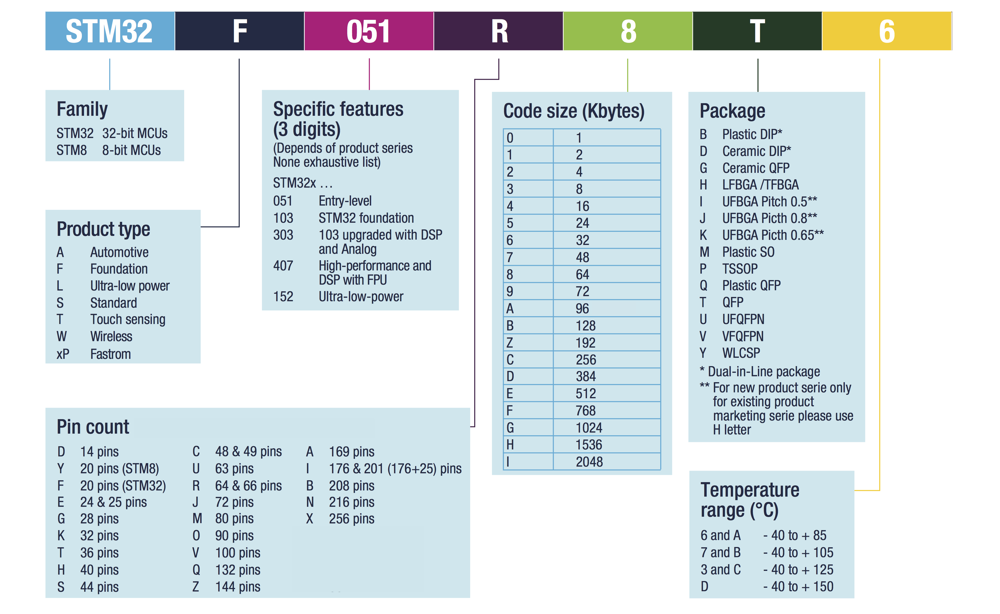

# STM32, The Easy Way

Do you already have some experience with Arduino, and want to step up the game into proper ARM embedded system developments? If so, you're in the right place!

We're going to take a look how to get started with STM32 microcontrollers. And to lower the entry barrier, we'll be using softwares that are free, and only $4 worth of hardwares.

This tutorial is designed to be detailed and easy to follow. However, it is **NOT** meant to be a comprehensive guide. Instead it aims to get your started quickly and ease the transition from Arduino to a lower level environment.

## Why STM32?

Now there are many good reasons to stay inside the Arduino ecosystem. After all, it kickstarted the "maker" revolution in the first place. The consistent hardware, simple IDE, and the excellent community support meant it's easier than ever for people to start creating what they want, and the abstraction layer shielded them from the low-level nitty-gritties like peripheral configuration and fuse settings.

It's all well and good, and most people are perfectly content with that. However, when you look at the actual chip on most Arduinos, you'll find an aging ATmega328P, a decade old 8-bit chip with a tiny amount of RAM, limited peripherals, and a leisurely clock speed. As a result, in commercial situations 8-bitters like those have been mostly relegated to cost-sensitive applications like cheap toys. And the world has largely moved on to 32-bit microcontrollers.

Now I'm not saying 8-bit Arduinos have gone completely pointless, in fact they are excellent learning tools and more than adequate for most hobby projects. It's just **if you want to go further down the path of embedded development, plain old Arduino just simply isn't going to cut it.**

Most of the 32-bit microcontrollers today uses ARM Cortex-M architecture, examples include STMicroelectronics' STM32 line, NXP's LPC line, Atmel's own SAM line, and just about every single IoT chips out there today. Those 32-bit chips tends to run faster, have great deal of more memory and peripherals, and even cheaper than the comparable 8-bit chips.

To demonstrate, here is a comparison between Arduino and my go-to STM32 chip, STM32F072C8T6:


I think the table speaks for itself. And here's a brief summary:

### Advantages:

#### High performance 

Even the cost-oriented F0 series beats the Arduino in terms of power and peripherals. As a result, you'll be able to develop larger and more sophisticated programs, with better performance and more connectivity options.

#### Full debugging support

Hardware debugging is supported on all STM32 chips, than means you have single stepping, breakpoints, memory viewer, all the usual stuff. No need to rely on ```println()``` like on Arduino anymore.

#### Versatile, Reusable and Future-proof:

There are **hundreds** of STM32 variants to choose from. You can go from 50 cents STM32F0 up to 400MHz STM32H7. All of them uses the same tool and code structure so it's trivially easy to port between them. They also mostly have the same pinout for a given package type, so you can simply drop in a more powerful chip without changing the circuit design should the needs arises.

#### Integrated Bootloader

All STM32 have built-in bootloader for uploading firmware without using a programmer. This can be done through Serial, USB or even I2C, SPI and CAN bus, all without taking up user flash memory like Arduino does.

#### 5V tolerant

All digital pins are 5V tolerant, so you can safely hook them up to legacy systems.

### Disadvantages:

Of course there are reasons that STM32 isn't as popular as Arduinos in the makers crowd, and to name a few:

#### Learning curve

It seems that there aren't many guides that give a concise and clear instruction on *just how to get started*. Well I hope this one changes that.

#### Board choices

You'll want to get a dev board to learn the basics, and there simply aren't many around. ST makes a few themselves, and there are some cheap ones on eBay. We'll touch on this problem later, but know that it's not that much big of a problem for now.

#### Community and library support

It's obvious that STM32 doesn't have as many community members as Arduino does, and as a result there aren't as many ready-to-use libraries available. Hopefully this guide will help with that, and we'll take a look at how to write your own libraries and converting existing Arduino libraries in a later lesson.

### Conclusion

32-bit microcontrollers like STM32 is much powerful and versatile than 8-bit chips, and is where the industry currently heading towards. It is the logical next step if you want to go beyond the limitation of Arduino. 

## STM32 naming schemes

Here is the official naming convention: 



You can also tell what ARM processor core a chip is using by looking at the 2 characters just after ```STM32```:

| STM32 Series |   ARM Core   |
|--------------|--------------|
| F7, H7       | Cortex-M7F   |
| F4, F3, L4   | Cortex-M4F   |
| F2, F1, L1   | Cortex-M3    |
| L0           | Cortex-M0+   |
| F0           | Cortex-M0    |

Now you're able to eyeball the capability of a chip by just looking at the feature numbers.

Generally speaking, the higher the number, the better the performance and the variety of peripherals, but also more expensive. F0 is more than adequate for most projects.

## What you'll need