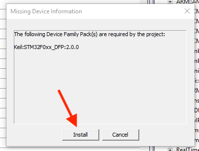
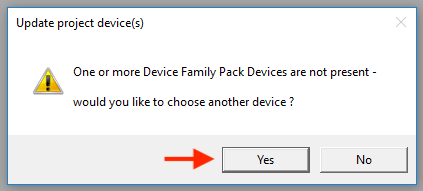
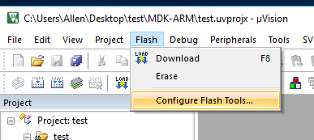
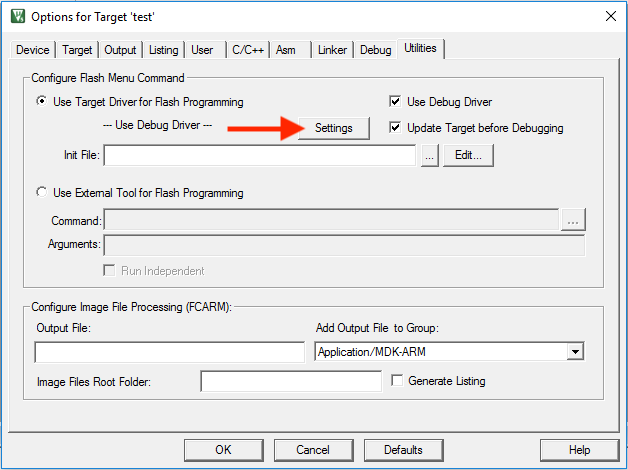
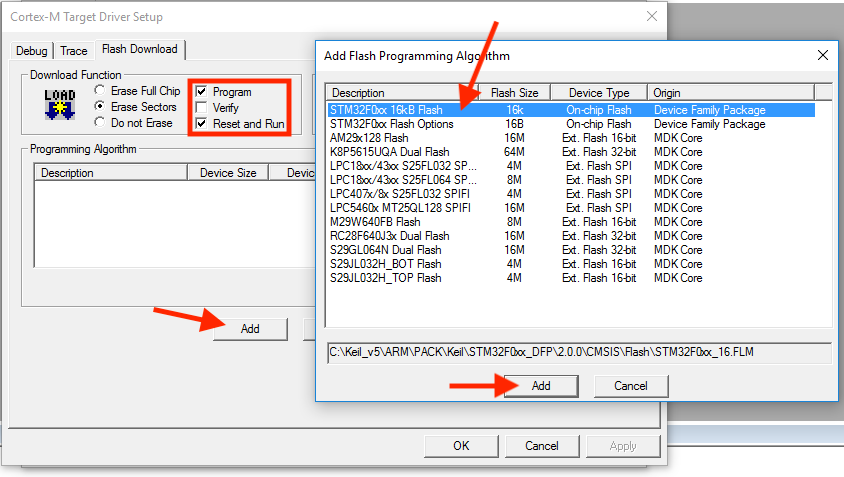
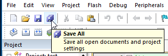

# Keil MDK First Time Setup:

If it's the first time MDK is running, the "Pack Installer" will pop up again and ask you to install another package:

Confirm, look at lower right corner for progress, and wait for it to finish.

If you see this afterwards, click `Yes`:

Then select our chip from the list:

If it still says device not found, ignore it. After all that, you'll be greeted with this:

There are a few more things we need to change. Click `Flash` menu then `Configure Flash Tools`

Then the `Settings` button:

First uncheck `Verify` then check `Reset and Run`. This allows your program to start running right away after uploading instead of having to press the reset button every time.

If the `Programming Algorithm` box is empty, press the `Add` button and select the `STM32F0xx 16kB Flash` entry and press `Add`.

Press `OK` a few times to go back to the main screen, then press `Save All` button to save all the settings we just changed.

