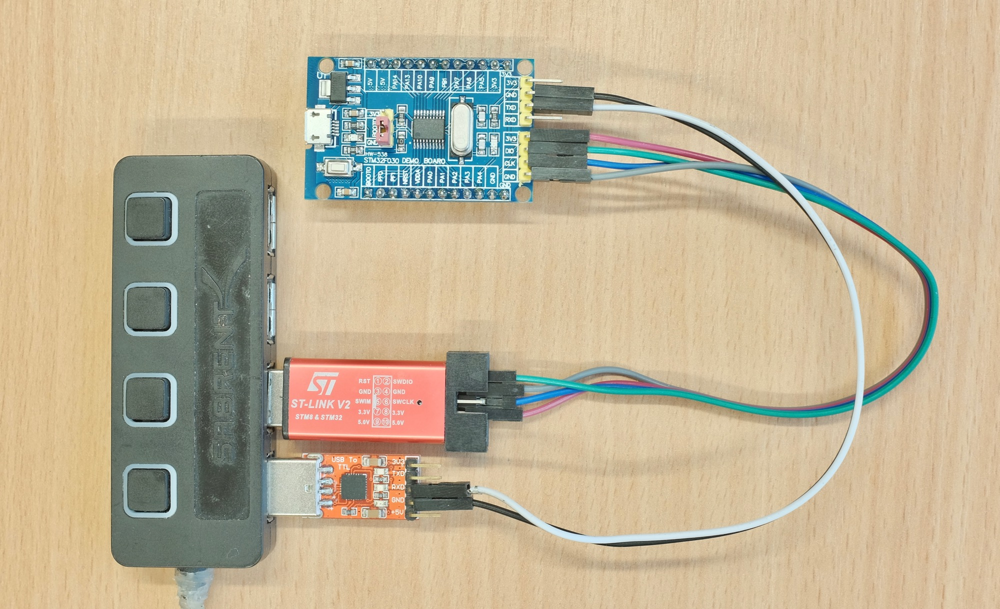
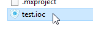
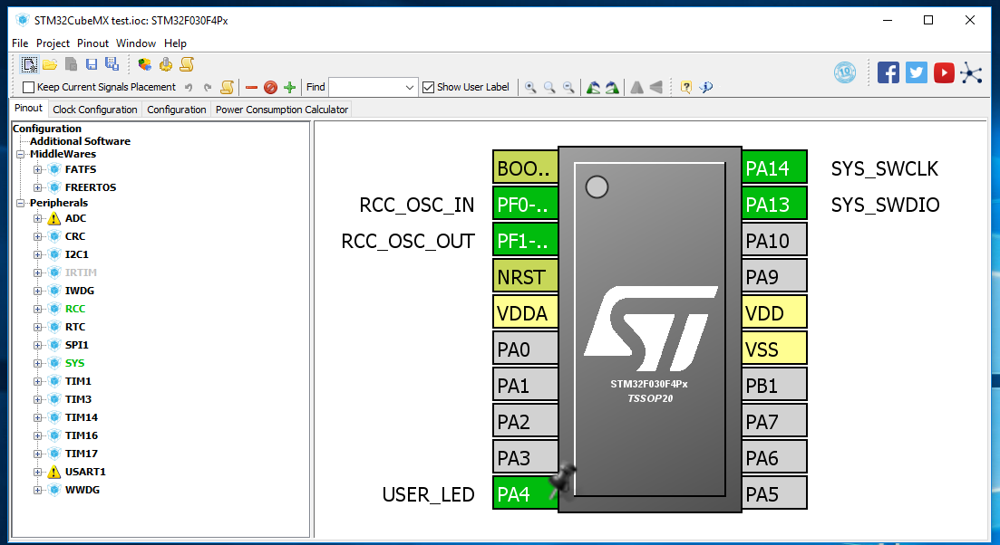
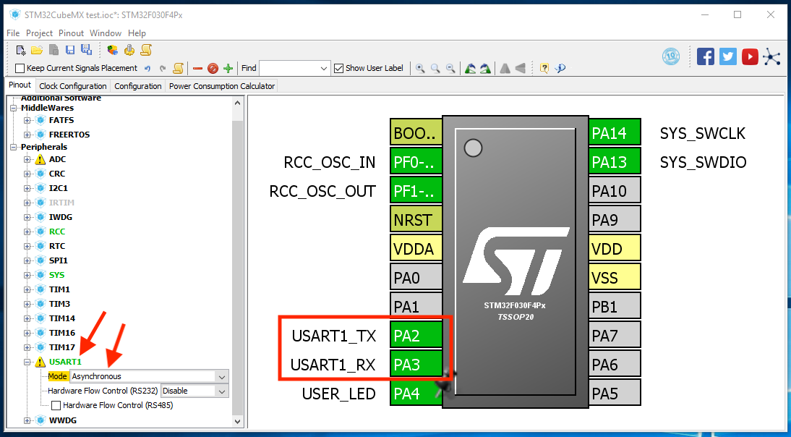
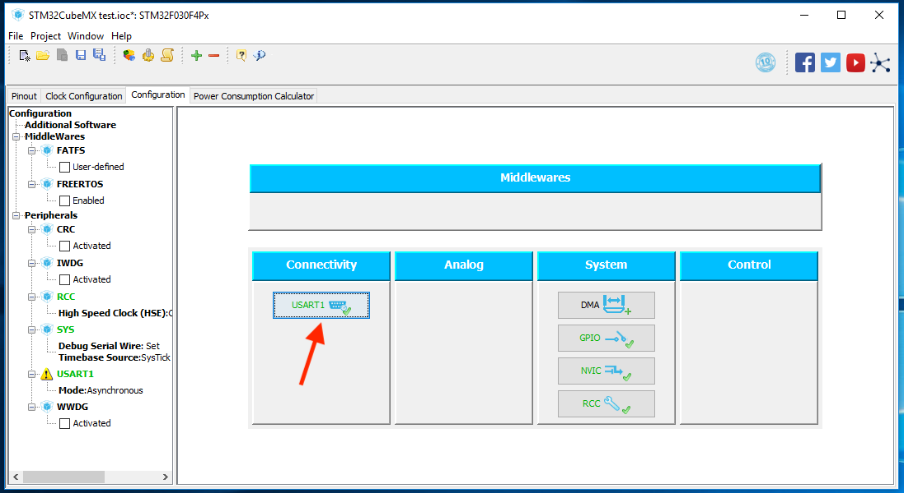
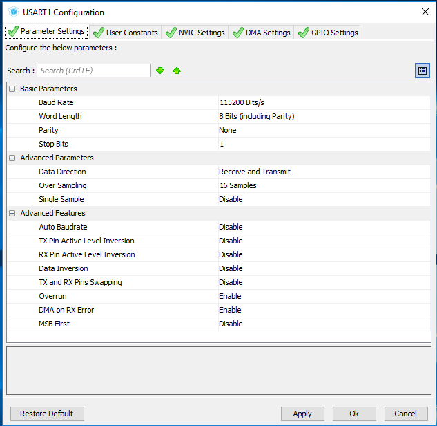
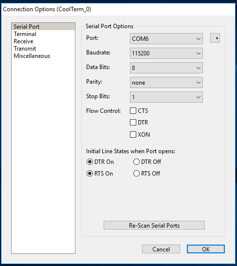
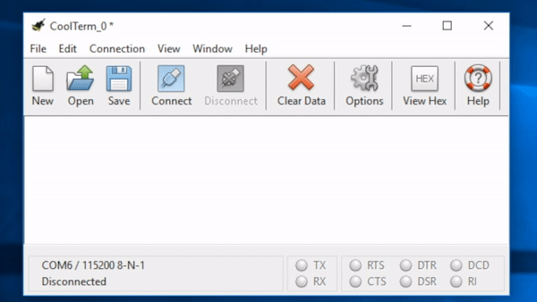

# Lesson 1: STM32 UART Transmit

[Landing Page: Intro and Required Hardwares](../README.md)

[Lesson 0: Setup and Blinking LED](../lesson0_intro_blinkLED/README.md)

**`THIS LESSON`** Lesson 1: UART Transmit

[Lesson 2: External GPIO Interrupts](../lesson2_external_interrupt/README.md)

[Lesson 3: UART Receive and External Files](../lesson3_serial_recv_interrupt)

[Lesson 4: Timers, PWM and Watchdog](../lesson4_timers_and_pwm/README.md)

[Lesson 5: SPI and I2C Communication](../lesson5_spi_i2c/README.md)

[Lesson 6: Real-time Operating Systems (RTOS)](../lesson6_rtos/README.md)

[Lesson 99: Miscellaneous](../lesson99_miscellaneous/README.md)

## Introduction

In this lesson we'll set up the UART, then use `printf()` to print our `hello world` over serial. There is no need to elaborate on how important UARTs are in embedded systems, so let's get right to it!

## Recommended Readings

If you need a refresher on serial communications, Speakfun has an [excellent tutorial](https://learn.sparkfun.com/tutorials/serial-communication).

[CoolTerm](http://freeware.the-meiers.org/) is used to view our serial messages, so check out [this guide](https://learn.sparkfun.com/tutorials/terminal-basics/coolterm-windows-mac-linux). Of course you can use your preferred terminal emulators too.

## Hookup

A serial-to-USB adapter is used in this lesson, connect the **RXD on the adapter** to the **TXD on the dev board**, and connect the **GND of dev board and adapter** together. See the black and white wires below:



## UART setup in STM32CubeMX

We will be reusing the entire project from the last lesson, so just **make a new copy of the project folder**. After that, double click and open the `.ioc` file.



Which will take you back to the pin view page:



This time we expand `USART1` and select `Asynchronous` mode. Two more pins are now in use. `PA2` is TX, while `PA3` is RX.



Normally that would be enough. However, the UART header on our board is actually connected to PA9/PA10 instead of PA2/PA3. **[Follow this short guide](alt_locations.md) to switch them around.**

Next we go to the configuration page. Click the newly appeared button to adjust a few settings.



Only thing actually needs changing is the baud rate, 115200bps is used in this case.

While you're here take a look at the `Advanced Features`, so many options! It even has TX/RX pin swapping for when you forget to cross the wires! What a world we're living in.



That's it for the CubeMX! **Make sure the Keil MDK is closed**, and regenerate the code: 


The best practice to **keep Keil MDK closed while regenerating the code in STM32CubeMX**, this keep things consistent and less likely to corrupt the project files. After it's done, click `Open Project` button to launch Keil MDK.


## Printing "Hello World"

Now we're ready to code our "Hello World" program. Remember what to do when encountering a new peripheral? Yep, we go and see what functions we can use in the HAL library files.

Looking at the [stm32f0xx_hal_uart.h](sample_code/Drivers/STM32F0xx_HAL_Driver/Inc/stm32f0xx_hal_uart.h), we find the following functions:

```
/* IO operation functions *****************************************************/
HAL_StatusTypeDef HAL_UART_Transmit(UART_HandleTypeDef *huart, uint8_t *pData, uint16_t Size, uint32_t Timeout);
HAL_StatusTypeDef HAL_UART_Receive(UART_HandleTypeDef *huart, uint8_t *pData, uint16_t Size, uint32_t Timeout);
HAL_StatusTypeDef HAL_UART_Transmit_IT(UART_HandleTypeDef *huart, uint8_t *pData, uint16_t Size);
HAL_StatusTypeDef HAL_UART_Receive_IT(UART_HandleTypeDef *huart, uint8_t *pData, uint16_t Size);
HAL_StatusTypeDef HAL_UART_Transmit_DMA(UART_HandleTypeDef *huart, uint8_t *pData, uint16_t Size);
HAL_StatusTypeDef HAL_UART_Receive_DMA(UART_HandleTypeDef *huart, uint8_t *pData, uint16_t Size);
```

That's a lot of choices ending in `_Transmit` and `_Receive`. However, they are all suffixed with either nothing, or `_IT`, or `_DMA`. **[Take a look at this guide](hal_io_modes.md) to learn about the I/O modes in STM32 HAL.**

We'll be using blocking mode in this lesson, and interrupt mode in the upcoming ones. DMA is an advanced topic and currently not covered in this series. Therefore, we're simply using `HAL_UART_Transmit()`. [Click here for details about this function](HAL_UART_Transmit_details.md).

You can use this function on its own, however since serial is mostly used to print debug messages, it's a better idea to get `printf()` working instead. And all you have to do is provide your own `fputc()` function:

```
int fputc(int ch, FILE *f)
{
    HAL_UART_Transmit(&huart1, (unsigned char *)&ch, 1, 100);
    return ch;
}
```
This is called for each character that `printf` tries to print, and in this case just sends the character through serial.

You can put this anywhere in `main.c`, but I like to put it inside `/* USER CODE 0 */` block just before `main()` function.

After that you'll be able to use `printf()` just like everywhere else, that means we can now get `hello world` out of the way:

```
printf("hello world\n");
HAL_Delay(500);
```

Put it in the `while` loop in `main()`, compile and upload. You can see the [finished file here](sample_code/Src/main.c).

Launch CoolTerm and select the correct serial port, set the baud rate to 115200 as before, and observe:





Congratulations, you got UART and `printf` working! And this is the proper full-fat `printf` instead of the neutered version in Arduino that doesn't even work with floating numbers!

## Homework

Try printing out the current millisecond once every 500ms using formatted `printf`. The results should look like this:

```
current time: 500
current time: 1000
current time: 1500
.........
```

As a reminder, you can get the millisecond reading from `HAL_GetTick()`, and [take a look at this](https://fresh2refresh.com/c-programming/c-printf-and-scanf/) if you're not familiar with formatted `printf`.

[Click me to see the answer](homework_answer.md).

## Next Steps

We'll take a look at reading GPIO pins and using external interrupts in the next lesson.

[CLICK ME TO GO TO NEXT LESSON](../lesson2_external_interrupt/README.md)

## Questions?

If you have any questions, feel free to [open an issue](https://github.com/dekuNukem/stm32_the_easy_way/issues) or email me at `dekunukem gmail com`. The former is preferable since it helps other people too.
