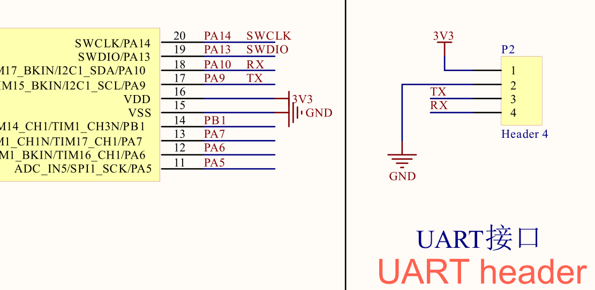
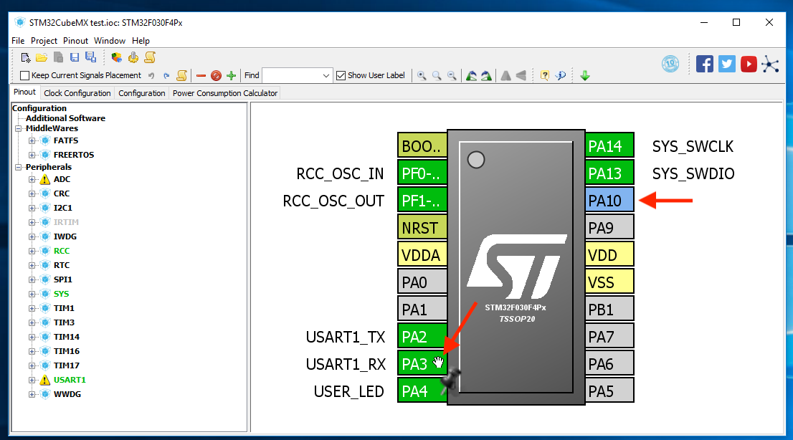
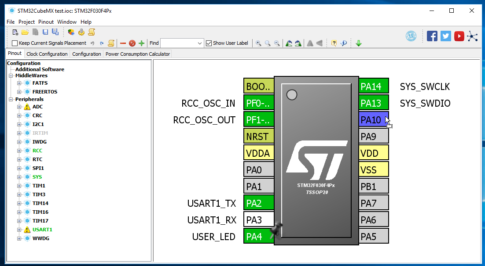
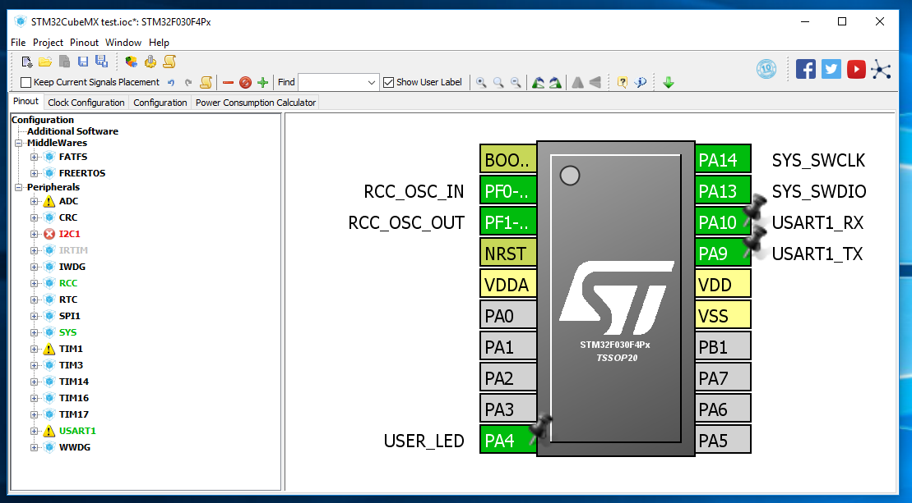

# Switching a Peripheral Pin to Alternative Locations

On STM32, most of the I/O peripheral pins have 2 or even 3 alternative locations in order to reduce pin usage conflict. In this short guide we'll see how to switch between them in STM32CubeMX.

We're going to use UART for example. Looking at [the schematic](../resources/datasheets/STM32F030F4P6_miniboard_schematics.pdf), the TX/RX on the UART header is connected to PA9/PA10 instead of default PA2/PA3 selected by SMT32Cube:

To switch to the alt location, hold down `Control` key and click on the `USART1_RX` pin, you'll see its potential alternative locations highlighted in blue, in this case `PA10`:

Without releasing `Control` key, you can then drag the current pin to the new location:

Do this to both TX and RX pins and move them to the alternative location:

Now we can use the UART header on the board.

You don't always have to use the alternative locations, and some pins don't have alternative locations at all. But it's nice to keep it in mind when you're designing your own board.