# Lesson 3: Interrupt-based UART receive and including external files

[Landing Page: Intro and Required Hardwares](../README.md)

[Lesson 0: Setup and Blinking LED](../lesson0_intro_blinkLED/README.md)

[Lesson 1: UART and Hello World](../lesson1_serial_helloworld/README.md)

[Lesson 2: External Interrupts](../lesson2_external_interrupt/README.md)

**`THIS LESSON`** Lesson 3: Interrupt-based UART Receive and External Files

## Introduction

In [Lesson 1](../lesson1_serial_helloworld/README.md) we looked at how to send data via UART. While undeniably important, a lot of applications requires reading from UART as well, which is often the tricky part.

In this lesson we'll look at utilizing internal interrupts to implement an efficient UART receive algorithm. I'm also going to introduce how to include external files to the current project to reduce clutter. This will also give you an idea on how to write your own libraries that you can reuse between different projects.

## Preparation

We'll be expanding upon [Lesson 1](../lesson1_serial_helloworld/README.md), so make a copy of the [project file](../lesson1_serial_helloworld/sample_code) and double check [the hookup](../lesson1_serial_helloworld/README.md#hookup).

Since we'll be using the RX line this time, connect an extra jumper wire from **`dev board RXD`** to **`serial adapter TXD`**.

## UART Setup

We have already done most of the setups in Lesson 1, there is just one more setting we need to change.

Open the `test.ioc` file and go to the `Configuration` page, click on the NVIC button, and enable the `USART1 global interrupt`

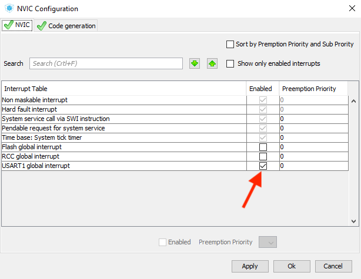

This enables all USART1 interrupts, and we will use a few of them to implement our receive algorithm. Regenerate the code and launch the IDE.

## Reading from UART

### Problems with Blocking I/O

As we touched upon in the first lesson, there are [multiple I/O modes](../lesson1_serial_helloworld/hal_io_modes.md) you can use with STM32 peripherals. We used blocking mode `HAL_UART_Transmit()` in that lesson, which is simple and gets the job done.

However the problem of blocking mode becomes apparent when it comes to receiving data. Looking at the `HAL_UART_Receive()`function:

```
HAL_UART_Receive(UART_HandleTypeDef *huart, uint8_t *pData, uint16_t Size, uint32_t Timeout);
```

In this function you must specify how many bytes you want to receive, it will then block until it has received that amount, or timeout.

The trouble is that we usually don't know how much data are coming or when. So when using blocking I/O for UART receive, the majority of CPU time is going to be wasted just waiting for data to arrive, and we can't do anything else. This is why interrupt mode makes much more sense in this case. The interrupt only fires when new data arrives, and you can carry on doing other tasks in the meantime.

### Interrupt-based UART Receive

As usual, we take a look at provided library file to see what we can use. In this case it's [stm32f0xx_hal_uart.h](sample_code/Drivers/STM32F0xx_HAL_Driver/Inc/stm32f0xx_hal_uart.h) and [stm32f0xx_hal_uart.c](sample_code/Drivers/STM32F0xx_HAL_Driver/Src/stm32f0xx_hal_uart.c).

Just like [last time](../lesson1_serial_helloworld/README.md), we'll find a number of I/O functions for UART:


Only this time we're going to use interrupt-based IOs that ends in `_IT()`. Specifically, `HAL_UART_Receive_IT()`:

```
HAL_StatusTypeDef HAL_UART_Receive_IT(UART_HandleTypeDef *huart, uint8_t *pData, uint16_t Size)
```
`huart` is the device handle that was generated automatically in `main.c`, `pData` is an array of `unsigned char` where received data is stored, and `Size` is the number of bytes you want to receive. Obviously, the size of `pData` array should be bigger than `Size`, otherwise buffer overflow may occur.

Once this function is called, the corresponding callback/ISR will fire when `Size` number of bytes have been received, and they'll be stored in the `pData` buffer.

There are a number of ways of setting this up, and you're free to experiment. But since most of the time we don't know exactly how much data is coming, I usually set the `Size` to 1. This way an interrupt fires every time a byte is received, and then we can store that byte into a separate buffer and decide follow-up actions.

### ISR/Callbacks

As we touched upon in [the last lesson](../lesson2_external_interrupt/README.md), interrupt callback functions all have `__weak` attribute, and alway ends with `Callback`. So if you define another function with the **same name and arguments** somewhere else, the compiler will use the new one instead. This is how you should write your own ISR functions.

We can see a bunch of those weak callback functions in the [stm32f0xx_hal_uart.h](sample_code/Drivers/STM32F0xx_HAL_Driver/Inc/stm32f0xx_hal_uart.h):

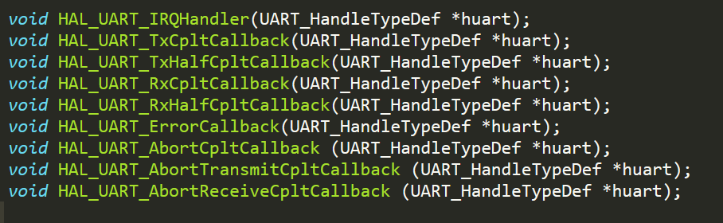

The names are more or less self-explanatory, and it's easy to see that `HAL_UART_RxCpltCallback()` is the one we're looking for.

### Putting it together

First we declare our buffer. Since it holds only one byte, I'm going to call it `uart_byte_buf`:

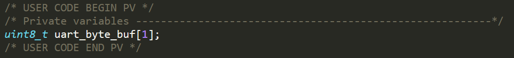

Then we need to start the interrupted-based UART receive. Call the function before the main loop:

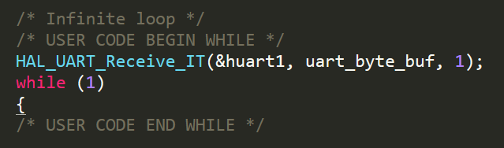

Finally we need to write our own callback function. Remember that the name and arguments has to be exactly the same as the provided `__weak` functions in the library `.c` file. You can put it anywhere, in this case I put it between the `USER CODE 0` block:

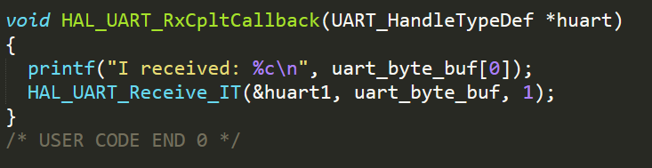

It simply prints out whatever is received, then start a new interrupted-based UART receive.

That's it! Compile and upload. You can find the finished code [here](sample_code/Src/main.c).

Try out this simple example by sending some characters through the serial monitor, and it will print back what was received. This process is entirely interrupt-based, so no time is wasted when no data is coming.

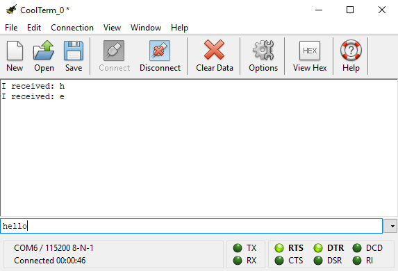

However, you'll quickly notice that only the first few letters will be printed back. This is because in this ISR we're printing out 14 bytes for each new byte coming in. This takes a huge amount of time, and as a result the new incoming data was dropped.

So again, don't forget to **`Keep your ISR as short as possible`**. Take a look at [good ISR practices](https://betterembsw.blogspot.co.uk/2013/03/rules-for-using-interrupts.html) for a refresher.

What should we do in this case then? One good approach is to simply store the incoming byte in another buffer, then check it periodically in the main loop. This way the ISR is kept quick and short, reducing the possibility of data loss.

We'll implement this approach in the next section.

## Including External Files

So far we have put all our code in `main.c`. This is fine for simple examples, but in real life projects the complexity will quickly go out of control and create a huge mess. A better solution is to write your code in separate files and include them in `main.c`, just like those [driver files](sample_code/Drivers/STM32F0xx_HAL_Driver/Inc) that we've been looking at.

In this section we'll implement a linear buffer as a pair of `.h` and `.c` files, then include and use them in `main.c`.

### Recommended Readings

If you need a refresher on including files in C, [here is a simple example](https://stackoverflow.com/questions/7109964/creating-your-own-header-file-in-c).

There is also [a comprehensive guide](resources/CHeaderFileGuidelines.pdf) made by University of Michigan which is much more detailed and technical.

### Preparations

Create an empty `linear_buf.h` file in the `Inc` folder, and `linear_buf.c` in the `Src` folder.

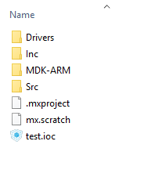

As with best practice, we put an include guard in`linear_buf.h`:

```
#ifndef LINEAR_BUF_H
#define LINEAR_BUF_H

// code goes here

#endif
```

Now go back to Keil IDE, right click `Application/User` folder, and select `Add Existing Files to...`

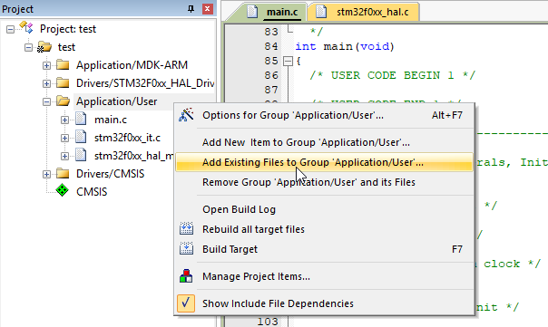

Since we'll be adding both `.c` and `.h` files, select `All files` in file type menu.


Now go to the respective folders and add both `linear_buf.h` and `linear_buf.c` to our project.

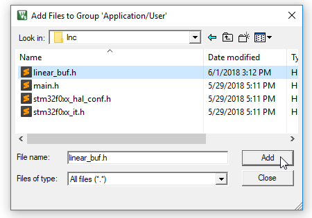

Now the new files should appear in the project explorer on the left. And don't forget to actually `#include` the header file in `main.c` between the `USER CODE Includes` block.

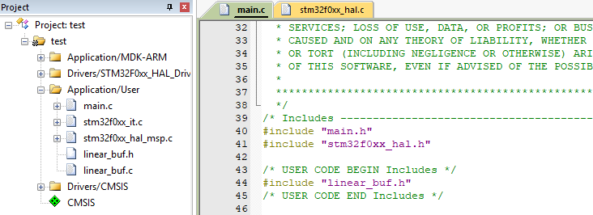

Press `F7` to compile our project with the new files, and it should do so without error.

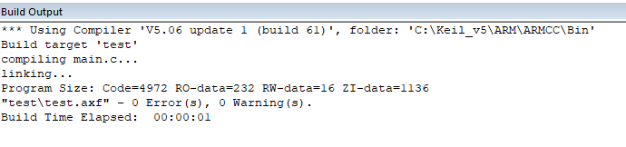

### Building it up

So far there is nothing in our pair of `linear_buf` files, and it's up to us to implement it. We want to store the incoming byte in a buffer, and have an easy way to check if some action should be taken.

Let's focus on the buffer part first, while we can simply declare an `char` array, it is cleaner and more modular to put everything into a `struct`, which is what we're doing.

In the header file `linear_buf.h`, between the include guards, we declare a `struct` called `linear_buf`:

```
#define LB_SIZE 256

typedef struct
{
	int16_t curr_index;
	char buf[LB_SIZE];
} linear_buf;
```

The `LB_SIZE` marco denotes the size of the buffer, you can change it depending on your need. Keep in mind that this space is allocated in the RAM, which is 4KB in the board we're using.

Then inside the `linear_buf` struct, we have `curr_index` pointing to the end of data currently in the buffer, as well as the `buf` itself. The operating principle therefore is very simple: 

* Initially the buffer is empty, and `curr_index` points to the first element in the `buf` array:

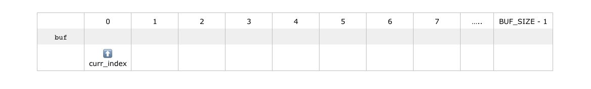

* When a new byte arrives from UART, we store it where `curr_index` is pointing, then increment `curr_index`:

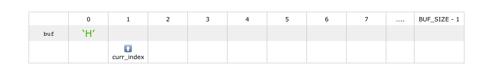

* This goes on as more data arrives:

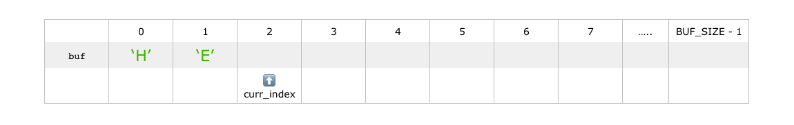

* Until all data has been received and stored in the buffer:

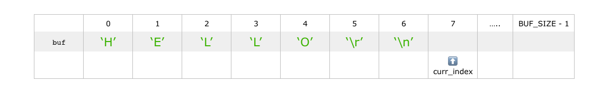

* At this point we can retrieve the data and reset the buffer, after which the process starts all over again:


We have already set up the buffer, which is the `linear_buf` struct. Now we just need to write a few companion functions to make it useful.

First up is `linear_buf_reset()`. It wipes the buffer clean and resets the `curr_index`.

We write the function body in `linear_buf.c`:

```
#include <string.h>
#include "linear_buf.h"

void linear_buf_reset(linear_buf *lb)
{
  lb->curr_index = 0;
  memset(lb->buf, 0, LB_SIZE);
}
```

It simply sets `curr_index` to 0, then fill the buffer with 0 as well.

We're passing argument by pointer, so the target actually gets modified. Of course when playing with pointers you should always check for `NULL`, I omitted it for simplicity's sake, so do add your own when you have the chance.

Next we need to add the function prototype to the header to make it usable globally. The FP is exactly the same as the function declaration, only with a semicolon in the end. So just add this to `linear_buf.h`:

```
void linear_buf_reset(linear_buf *lb);
```

At this stage, `linear_buf.h` should look like this:

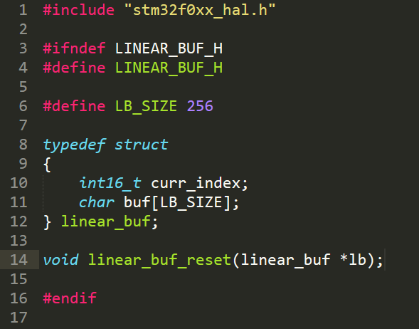

And `linear_buf.c` file should look like this:


Now that we can reset the buffer, next step is to add to it, cue `linear_buf_add()`:

```
void linear_buf_add(linear_buf *lb, char c)
{
  lb->buf[lb->curr_index] = c;
  if(lb->curr_index < LB_SIZE - 1)
    lb->curr_index++;
}
```

This one is pretty simple too, it puts the incoming byte into the buffer, then increment the `curr_index` if it's not already at the end. Put it in `linear_buf.c`, and don't forget to add the function prototype in `linear_buf.h` as well.

Finally, we need a function to check if we have what we want in the buffer. There are a lot ways of doing this, and it's highly dependent on your applications. Here are a few ideas:

* Data is ready when newline is received

* Data is ready when buffer is full

* Data is ready when UART has been idle for a while

* Data is ready when certain sequence is received

In this example I'm going to implement the first scenario, which is often useful in text-based communications:

```
uint8_t linear_buf_ready(linear_buf *lb)
{
  if(lb->buf[lb->curr_index - 1] == '\n')
    return 1;
  return 0;
}
```

Again, a really simple solution. It just checks if the last received character is a newline.

That's it! We have implemented our own non-blocking UART receive function! In the end `linear_buf.h` should look like this:

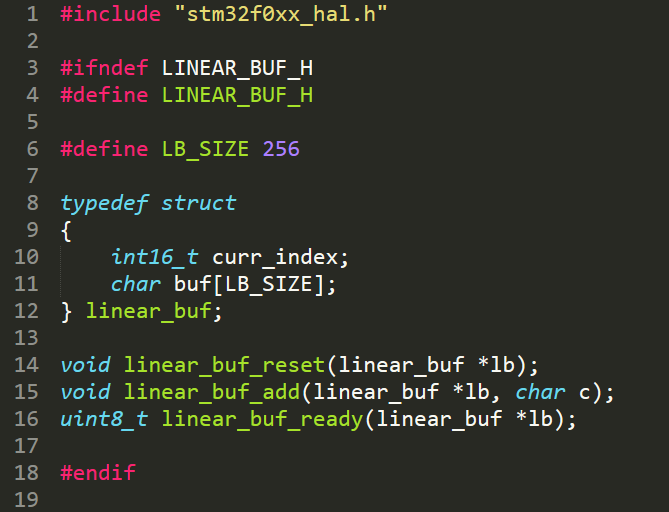

And `linear_buf.c` should look like this:

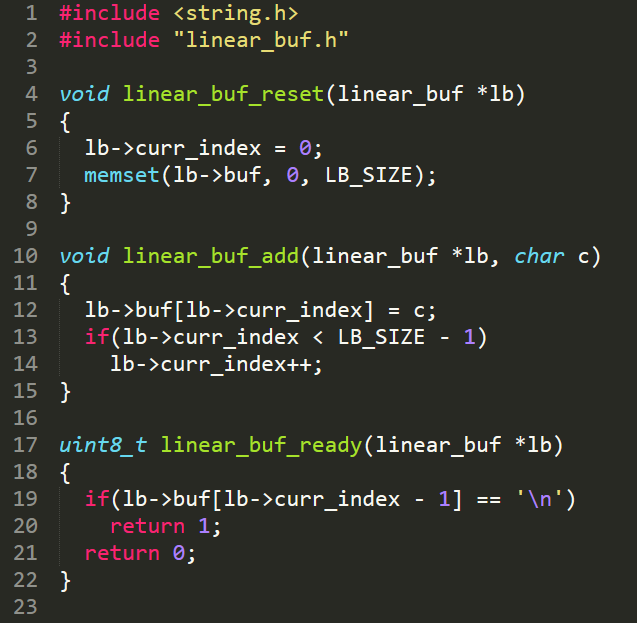

Let's try it out! In the `main.c`, declare a `linear_buf` struct to use as UART receive buffer:

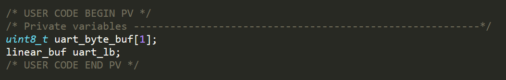

Before the main loop, start receiving from UART using interrupts:

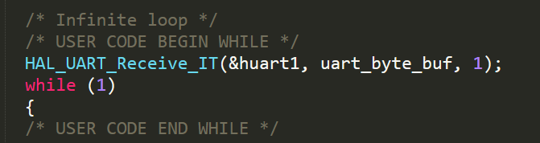

An interrupt will fire when a byte is received. We simply store it in our `uart_lb`:

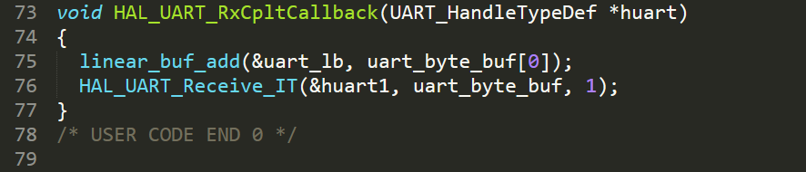

Finally in the main loop, we check if the data is complete. Then print and clear the buffer:

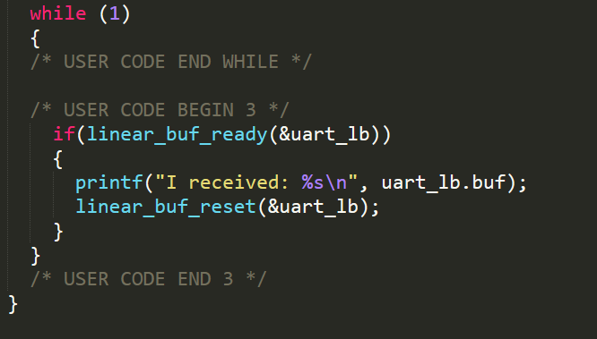

Type something in the terminal emulator ending with a newline, and the message will be echoed back:

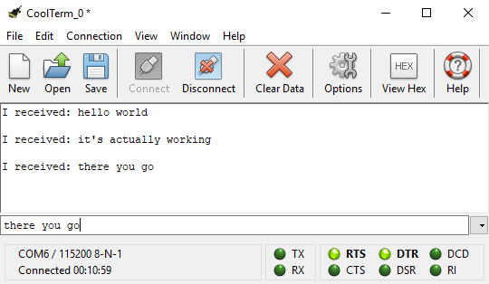

You can find the [completed project here](sample_code_linear_buf/). This is a very simple yet practical implementation of interrupt-based UART receive. It's much faster than polling, frees up CPU time, and has a fast response time.

Also, since we wrote everything in external files, we can reuse them whenever we want by including them in another project.

### Limitations

I did try to keep the code as simple as possible, as a result there are a number of limitations to keep in mind if you want to use this as-is. After all, it's only 20 lines of code.

Since `linear_buf_ready()` only checks the very last byte in the buffer, if new data comes in before this function is called, a previous `\n` might be missed. This can be remedied by checking `linear_buf_ready()` more frequently, or modifying the code to check every byte in the buffer.

The behavior when buffer is full is also not well defined in `linear_buf_add()`, right now it just stops accepting new data, but you can change it depending on your desired outcome.

## Bonus: Sharing Variables with `extern`

So far we created our own `.h` and `.c` file and used them in `main.c`, all is well.

However, sometimes we want to go the other way and access variables in `main.c` from our `.h` and `.c` file too. One popular example is accessing device handles. We can do this by using the `extern` keyword. [Here is a refresher](https://stackoverflow.com/questions/1433204/how-do-i-use-extern-to-share-variables-between-source-files) regarding this topic.

For example, if we want to access `huart1` device handle inside `main.c` from our `linear_buf.h` and `linear_buf.c`:

* Make sure `linear_buf.h` is included in `main.c`

* Find the declaration of `huart1` in `main.c`, which is `UART_HandleTypeDef huart1;`

* Simply copy that declaration into `linear_buf.h`, then add `extern` in front of it: `extern UART_HandleTypeDef huart1;`

* Now you can access `huart1` in `linear_buf.h` and `linear_buf.c` just like before.

Note that you might also want to `#include "stm32f0xx_hal.h"` in your header file, since it provides the definition of data structures in STM32 HAL libraries.

## Conclusion and Homework

In this lesson we looked at how to use interrupt to efficiently receive data from UART, and how to write and include external files to reduce clutter and improve code reusability. This is imperative as your project picks up complexity.

For the homework, I suggest making some modifications to `linear_buf` files to improve it. Maybe add `NULL` checks for safety, or make some changes to `linear_buf_ready()` and `linear_buf_add()` to suit your particular need. Anything goes, just play with it.

## Next Steps

Timer and PWM

SPI and I2C

RTOS