# Lesson 4: Timers and PWM

[Landing Page: Intro and Required Hardwares](../README.md)

[Lesson 0: Setup and Blinking LED](../lesson0_intro_blinkLED/README.md)

[Lesson 1: UART and Hello World](../lesson1_serial_helloworld/README.md)

[Lesson 2: External GPIO Interrupts](../lesson2_external_interrupt/README.md)

[Lesson 3: Receive and External Files](../lesson3_serial_recv_interrupt)

**`THIS LESSON`** Lesson 4: Timers and PWM

## Introduction

Timers are another commonly used peripheral in microcontrollers. They are used to keep track of time, raise periodic interrupts, drive PWM outputs, and many more besides.

In this lesson we'll take a look at two most common use cases: Timer interrupt and PWM output.

We'll also briefly cover the watchdog timer while we're at it.

## STM32 Timers

Each STM32 variant has several built-in timers. They are numbered from TIM1 to TIM20, and grouped into different types:

* `General purpose timers`: As the name suggests, those are the standard timers with functions like output compare, one-pulse, input capture, sensor interface, interrupts, PWM output, and many more.

* `Advanced timers`: Those come with even more bells and whistles, usually highly specialized like motor control and digital power conversion.

* `Basic timers`: Barebone timers with no outputs. Usually used for timekeeping.

* `Other timers`: Chip-specific timers like low-power or high-resolution timers.

Usually the higher-end the chip, the more timer it has. The details of STM32 timers is quite a rabbit hole, but we'll keep it simple in this lesson.

If you want to learn more, [Here is an cross-series overview](resources/timer_overview.pdf) of STM32 timers. There are also helpful information in the [timer section of the datasheet](resources/datasheet.pdf) of chip we're using.

## Preparation

Again, we'll be expanding upon [Lesson 1](../lesson1_serial_helloworld/README.md), so make a copy of the [project file](../lesson1_serial_helloworld/sample_code) and double check [the hookup](../lesson1_serial_helloworld/README.md#hookup).

## Timer Interrupts

Periodic interrupts is one of the most common use case for timers. They are mostly used for timekeeping or performing repetitive tasks. Arduino use it in `millis()` to keep track of milliseconds, video controllers use it to generate frame sync pulses, and operating systems use it for task switching to give the illusion of multitasking.

We're going to implement a simple example of timer interrupt: printing `hello world` every 100 milliseconds.

Open the `test.ioc` file, to the left of the screen we can see the available timers on this chip:

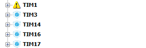

If you bothered to look at [page 18 of the datasheet](resources/datasheet.pdf), you'll find TIM1 is an advanced timer, while the rest are general purpose timers. They all have 16-bit resolution. TIM1 and TIM3 has 4 channels, and the rest has only 1 channel.

In this example I'm going to use TIM17. Expand it and check the `Activated` box:

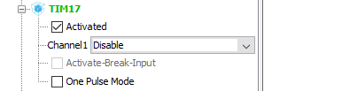

This enables timer 17. Now go to the `Configuration` tab, and click the newly appeared `TIM17` button:


Now we have a bunch of settings change:

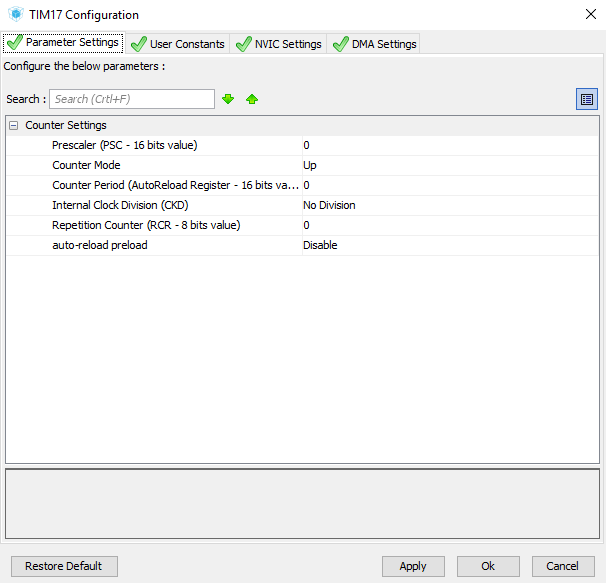

The part we're interested in is `prescaler` and `counter period`, as they determine the timer interrupt frequency. Some maths is going to be involved, but hopefully nothing too heady.

### Timer prescaler

Each timer is essentially a counter with programmable clock input. At each clock period, the counter increments by 1.

You can find timers' input clock speed on the `Clock Configuration` tab. In this case we see that the `APB1 Timer Clock` is 48MHz, same as system clock:

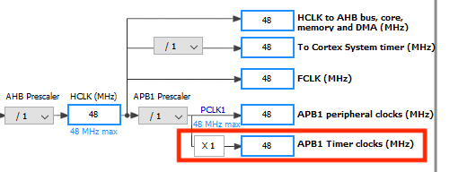

This means by default, the counter in timers counts up at 48MHz, which is obviously way too fast. Fortunately, we can slow down this clock by dividing it with a custom value. This value is called the *prescaler*.

Timer prescaler in STM32 is an unsigned 16-bit number by which the input clock is divided. The table below illustrates how it works:


As you can see, the input clock is divided by `prescaler + 1`. Not too bad.

### Timer counter period

Another thing to keep in mind while setting up timer interrupts is the `counter period`.

`counter period` is the upper limit of the timer counter, at which the counter will reset.

In other words, the counter will count up from 0 to `counter period`, at the clock speed obtained with the `prescaler` above. Once the counter reaches the `counter period`, it will reset to 0 and start all over again.

If interrupt is enabled, a `PeriodElapsed` interrupt raise when the rollover happens. This is the periodic timer interrupt that we were talking about earlier. 

### Getting the right number

It's easy to see that both `prescaler` and `counter period` affect the frequency of timer interrupts, and we need to calculate those two values based on our requirements.

Generally, you use `prescaler` to get the clock speed in the ballpack, then use `counter period` to fine tune the frequency.

For example we want our timer interrupt to happen every 100ms. To do this can use a 1KHz counter clock. Dividing input clock frequency by the desired output, we get a ratio of `48000000 / 1000 = 48000`. However since `prescaler` starts at 0, we need to subtract 1 from the ratio. Therefore our final `prescaler` is 47999, and this gives us a 1KHz clock to the timer counter.

Now that the counter ticks up every 1ms, we can set `counter period` to 100. As a result the counter counts up to 100 then resets, generating an interrupt every 100ms.

### Finding the right combination

It's easy to see that different combinations of `prescaler` and `counter period` can achieve the same result. For example we used `prescaler = 47999` and `counter_period = 100` for the 100ms interrupts above, however `prescaler = 23999` and `counter_period = 200`, or even `prescaler = 479` and `counter_period = 10000` works just as well. Again, it's up to you to decide what to use, with some nuances:

* Since `prescaler` and `counter period` are both unsigned 16-bit integers, neither of them can exceed 65535. 

* `prescaler` balances the range and resolution of your timer interrupt. A small `prescaler` allows you to fine tune the accuracy of periodic interrupt, but also limits the range.

For example, when `prescaler = 47`, counter clock is 1MHz. 1 counter tick is 1us, so you can adjust `counter_period` in 1us increments from 1us to 65535us = 65.53ms. 

While when `prescaler = 47999`, counter clock is 1KHz. 1 counter tick is 1ms and you can adjust `counter_period` in 1ms increments, giving you the range from 1ms to 65535ms.

Notice how in the first scenario you can fine tune the timer interrupt accuracy down to 1us, but the maximum period of timer interrupt is only 65 milliseconds. While in the second scenario the max period is 65 seconds, but can only be adjusted in 1ms increments.

There is also a detailed formula on page 10 of the [timer overview](resources/timer_overview.pdf) if you want more information.

### Try it out

Anyway, since that we have figured out the `prescaler` and `counter period`, we can type them in:

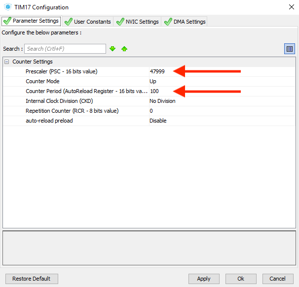

Make sure to enable the interrupt in the NVIC tab as well:

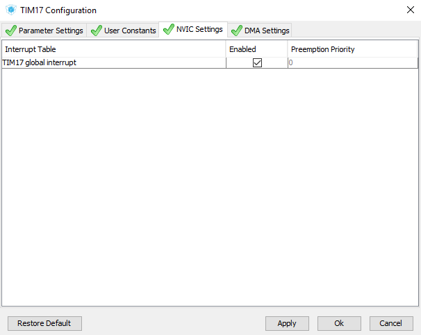

That's it! Regenerate the code and launch Keil MDK.

As usual, we look into [provided library files](sample_code/Drivers/STM32F0xx_HAL_Driver/) to see what we can use. Looking at the timer file [stm32f0xx_hal_tim.h](sample_code/Drivers/STM32F0xx_HAL_Driver/Inc/stm32f0xx_hal_tim.h), we can see a sea of library functions near the end, most of them for advanced features. 

For this simple example, we just need `HAL_TIM_Base_Start_IT()` to start the timer interrupt. Put it before the main loop:

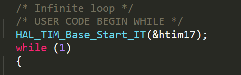

Then we need to write our interrupt callback function. The timer overflow interrupt in STM32 HAL is called `HAL_TIM_PeriodElapsedCallback()`. It has a `__weak` attribute, meaning if we write our own function with the same name and arguments, the compiler will use the new one instead.

So just copy this function's definition and put it anywhere you like in `main.c`, for this example it just prints `hello world`:

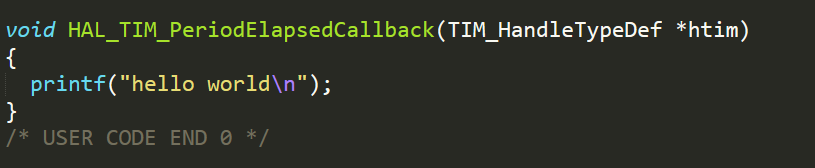

Compile and upload, and you'll see it's printing `hello world` every 100ms:

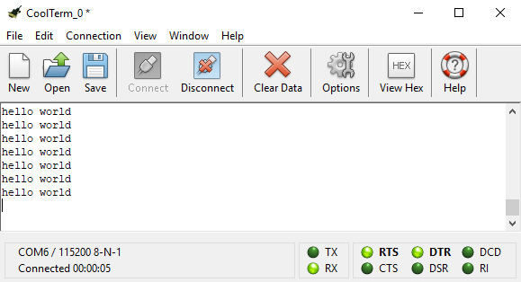

You can use timer interrupts like this to periodically update a screen, scan button matrix input, read a sensor, and much more.

Periodic timer interrupts like this happens at a consistent rate outside the main loop. They are more accurate than using `HAL_Delay()`, and more importantly they are not blocking, allowing CPU to do other tasks in the mean time.

You can find the [finished project here](sample_code).

## PWM Output

Another popular timer function is outputting PWM signals. Take a look at the [sparkfun tutorial](https://learn.sparkfun.com/tutorials/pulse-width-modulation) if you're not familiar with this topic.

Put simply, PWM works by switching a signal on and off very rapidly. The more time the signal stays on, the more power is delivered to the output. This is how [analogWrite()](https://www.arduino.cc/reference/en/language/functions/analog-io/analogwrite/) function in Arduino works.

In STM32 we have much more options and control for PWM generation compared to Arduino, although we'll stick to the basics for this lesson by using it to dim the on-board LED on PA4.

### Timer configuration

We'll continue working on the project from the previous section. Go back to STM32Cube and switch to `pinout` page:

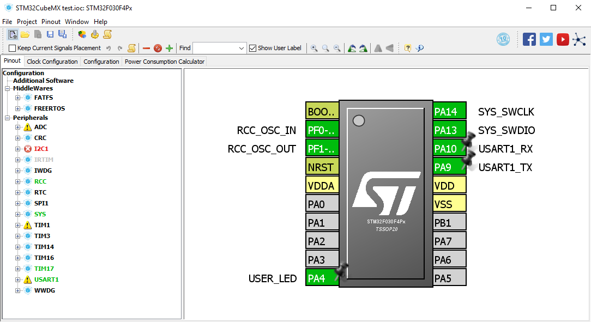

Just like Arduino, only certain pins on STM32 has PWM output. You can find out by left clicking a pin and see if it as `TIMXXCHY` function, where `XX` is timer number, and `Y` is channel number. Let's see what's on the on-board LED, `PA4`:

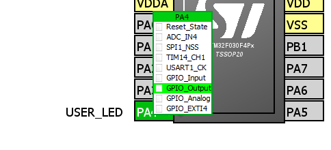

Bingo! `PA4` has `TIM14CH1`, meaning it's the output of timer 14 channel 1, and we can use it for PWM.

Click `TIM14CH1` to switch to that function:


Then on the side bar, activate TIM14, then set channel 1 function to `PWM Generation CH1`:

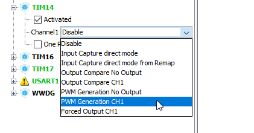

Go to the `configuration` page and click on the newly appeared `TIM14` button:

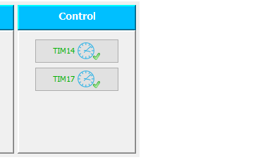

Now we're back at the counter settings, except this time there is an additional PWM1 section:

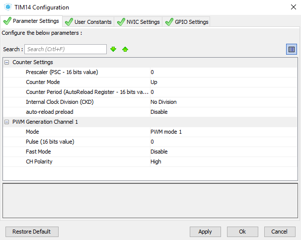

Just like last time, we have `prescaler` and `counter period`. Except in this case, instead of the interrupt frequency, they determine the PWM frequency.

Let's say we want the PWM frequency of our LED to be 1KHz. One option is to use `prescaler` of 47 and `counter period` of 1000.

The `prescaler` of 47 divides the 48MHz system clock down to 1MHz for the TIM14 counter, making it count up every 1us. And the `counter period` of 1000 makes the counter reset once the count has reached 1000. This way the counter resets every 1000uS, which is 1ms, which is a frequency of 1KHz.

The new parameter `pulse` determines the duty cycle of the PWM output, calculated as `pulse / counter_period`.

For example, if `counter period` is 1000 and you set `pulse` to 900, then the duty cycle is `900/1000 = 90%`, meaning the output stays high 90% of the time during a single PWM period. Obviously, `pulse` should be less or equal to `counter period`.

Anyway, let's type the numbers in and see what happens:

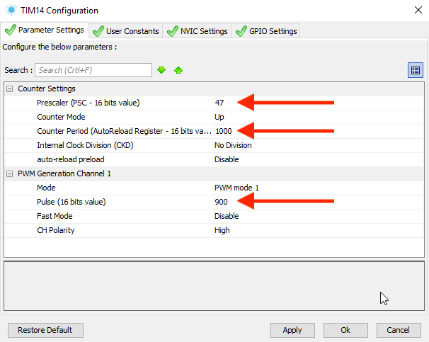

Generate the code, then go to Keil IDE.

### Try it out

To see PWM in action we need to make a few changes in the code. Before the main loop, call a few more initialization functions:

```
HAL_TIM_Base_Start(&htim14);
HAL_TIM_PWM_Init(&htim14);
HAL_TIM_PWM_Start(&htim14, TIM_CHANNEL_1);
```

Then delete everything in the main loop. It should look like this:


Compile and upload. Now LED should be much dimmer than before, almost unnoticeable compared to the power LED:

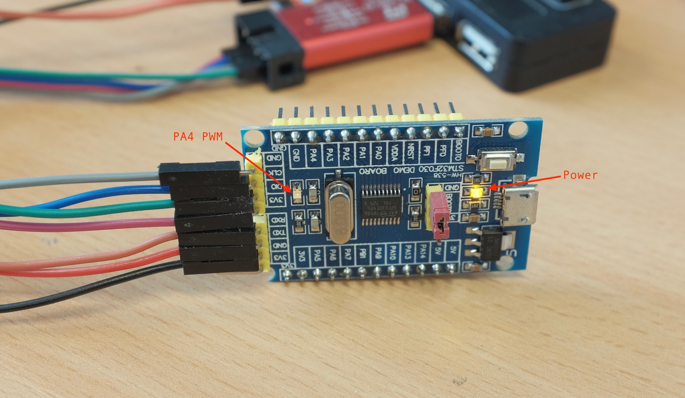

And if you have a logic analyzer, take a look at the waveform:

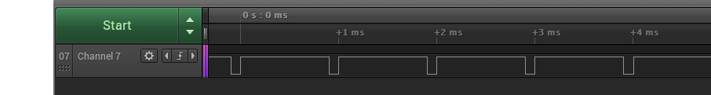

You'll see that the PWM signal has a period of 1ms, and stays high 90% of the time, exactly what we want.

Eagle eyed viewer might spot the LED is dim even though the duty cycle is high. Remember that the LED on PA4 is connected to 3.3V on the other end, so it lights up when PA4 is LOW.

### Changing duty cycle on the fly

Setting up duty cycle in STM32Cube is all well and good, but it would be more useful if we can change it while our program is running. Luckily you can manipulate peripheral registers directly in STM32 HAL. For adjusting duty cycle, simply write into `CCRx` register like this:

```
htim14.Instance->CCR1 = 900;
```
CCR1 is for channel 1, change it to CCR2, CCR3, CCR4 if you you're using other channels.

Low-level peripheral registers is another massive rabbit hole that I'm not going into. After all, abstracting them is what HAL library is for in the first place.

However if you're feeling adventurous, feel free to dive in the thousand-page [reference manual](../resources/datasheets/stm32f0_reference_manual.pdf) and find out the details about every single peripheral registers. Then you can find their `typedef`s in the beginning of [device header file](sample_code_pwm/Drivers/CMSIS/Device/ST/STM32F0xx/Include/stm32f030x6.h) and manipulate them directly.

Anyway, we can try it out by adding this in the main loop:

```
for (int i = 0; i < 1000; i+=3)
{
  htim14.Instance->CCR1 = i;
  HAL_Delay(1);
}
for (int i = 1000; i > 0; i-=3)
{
  htim14.Instance->CCR1 = i;
  HAL_Delay(1);
}
```

It ramps up the duty cycle, then back down again, resulting in a smooth "breathing" animation:

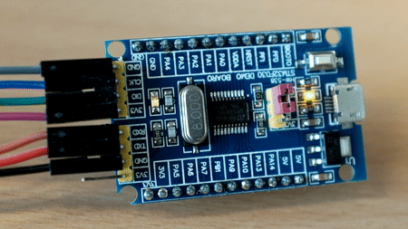

You can find the [finished code here](sample_code_pwm)