# Lesson 5: SPI and I2C

[Landing Page: Intro and Required Hardwares](../README.md)

[Lesson 0: Setup and Blinking LED](../lesson0_intro_blinkLED/README.md)

[Lesson 1: UART and Hello World](../lesson1_serial_helloworld/README.md)

[Lesson 2: External GPIO Interrupts](../lesson2_external_interrupt/README.md)

[Lesson 3: UART Receive and External Files](../lesson3_serial_recv_interrupt)

[Lesson 4: Timers and PWM](../lesson4_timers_and_pwm/README.md)

**`THIS LESSON`** Lesson 5: SPI and I2C

[Lesson 6: Real-time Operating Systems (RTOS)](../lesson6_rtos/README.md)

## Introduction

SPI and I2C are two very popular communication protocols in embedded systems. Countless sensors, memories, and peripheral chips use one of those to talk to the master. So it's only natural that we look at how to use them with STM32.

## Recommended Readings

If you need a refresher on how those two protocol works, Elliot Williams from Hackaday has written excellent articles explaining both [SPI](https://hackaday.com/2016/07/01/what-could-go-wrong-spi/) and [I2C](https://hackaday.com/2016/07/19/what-could-go-wrong-i2c-edition/) in detail.

Sparkfun also has introductory tutorials on both [SPI](https://learn.sparkfun.com/tutorials/serial-peripheral-interface-spi) and [I2C](https://learn.sparkfun.com/tutorials/i2c).

And as always you can go to Wikipedia: [SPI](https://en.wikipedia.org/wiki/Serial_Peripheral_Interface_Bus) [I2C](https://en.wikipedia.org/wiki/I%C2%B2C).

## STM32 SPI Communication

Once again, we'll be expanding upon [Lesson 1](../lesson1_serial_helloworld/README.md), so make a copy of the [project file](../lesson1_serial_helloworld/sample_code) and double check [the hookup](../lesson1_serial_helloworld/README.md#hookup).

### SPI Setup

To use SPI, enable `SPI1` in STM32CubeMX. STM32 supports a number of different SPI modes, but `Full-Duplex Master` is the most common mode for communicating with peripheral chips, so let's select that.

STM32 also supports `Hardware NSS Signal`, where the SPI CS pin is controlled by hardware. I suggest **NOT** using it, since its behavior is often not what you want. For example when sending multiple-byte commands the hardware CS goes down then up for every byte it sends, while you most likely want it to stay down for the entire sequence. All in all it's not worth the trouble, just set a GPIO as CS and be done with it.

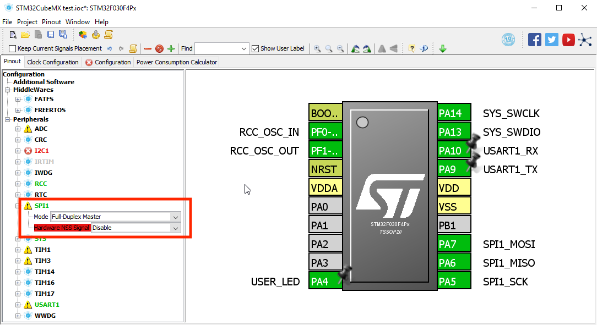

I set PA3 as the CS pin, you can use whatever free GPIO pin you want.

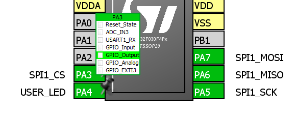

Go to `Configuration` tab and click the `SPI1` button to bring up its configuration window:

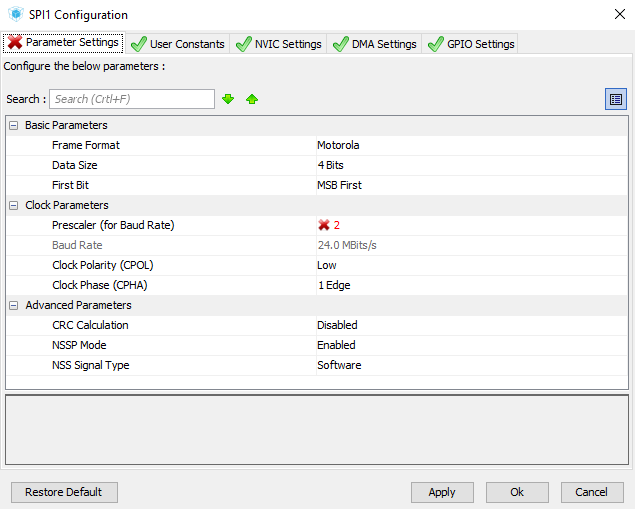

There are a number of settings that needs adjusting:

* Leave `Frame Format` at Motorola.

* `Data Size` is usually one byte, so change it to 8 bits.

* `Prescaler` changes the SPI clock speed.

* `CPCL` and `CPHA` depend on the SPI device.

* No need to touch anything in `Advance Parameters`

Of course most of those settings depends on what SPI peripheral you're using, so consult the datasheet to see what it needs.

For this simple demo I used this configuration:

Press `OK` to save the setting. Then press the `GPIO` button to set up the new CS pin we just selected.

We just need to change the initial output level to `High` so it doesn't assert the SPI device right away.

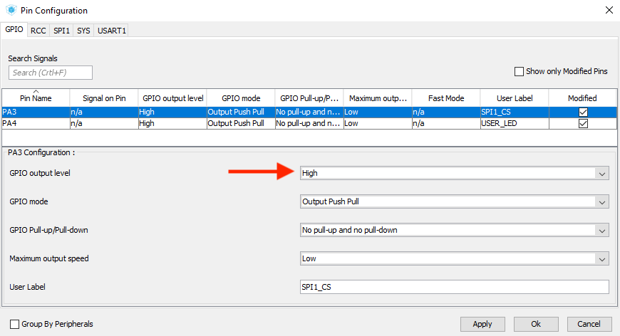

That's it! Regenerate the code and launch Keil MDK.

### Using SPI

As usual, we take a look at provided library file to see what we can use. Near the end of [stm32f0xx_hal_spi.h](sample_code_spi/Drivers/STM32F0xx_HAL_Driver/Inc/stm32f0xx_hal_spi.h), we see a number of provided functions:

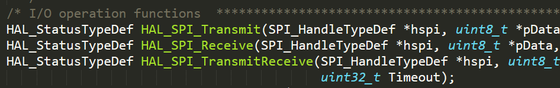

Since SPI operates like two shift registers connected in a ring, you will always receive the same amount of data that you send. Therefore your best bet is to use `HAL_SPI_TransmitReceive()`. 

Generally you need to declare two buffers with the same size, one for sending and one for receiving:

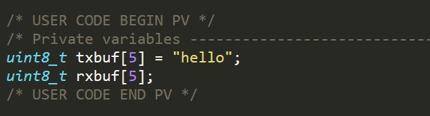

And when it's time, pull the CS line down, call `HAL_SPI_TransmitReceive()` with device handle, two buffers, amount of bytes to send, and a timeout.

The data from `txbuf` will be sent out, and at the same time the received data will be stored in `rxbuf`.

Don't forget to set CS pin to high afterwards:

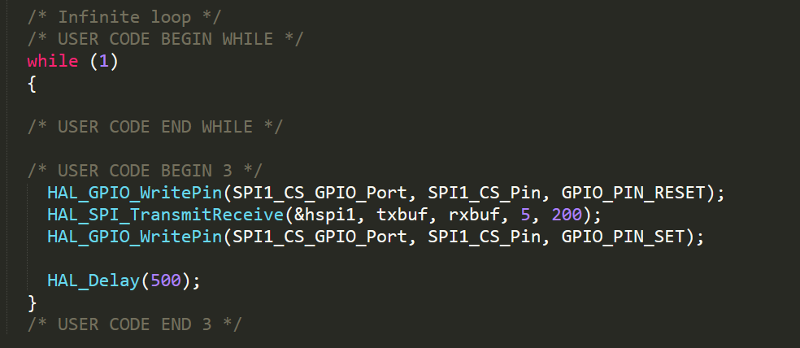

You can examine the waveform using a logic analyzer:

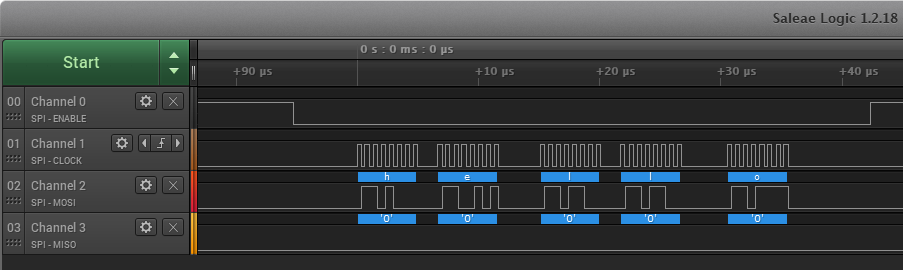

That's pretty much it for the SPI! You can find the [sample project here](./sample_code_spi).

With this knowledge, you can easily write your own library or port Arduino libraries to STM32 now.

## STM32 I2C Communication

Compared to simple and straightforward signaling of SPI, I2C uses fancy open drain outputs and different slave addresses to allow multiple devices on the same bus. The clock speed is often much slower than SPI, and you need additional pull-up resistors with appropriate values. However up to 127 devices can be used on the same two-wire I2C bus, massively simplifying the wiring compared to SPI.

Just like before, we'll be expanding upon [Lesson 1](../lesson1_serial_helloworld/README.md), so make another copy of the [project file](../lesson1_serial_helloworld/sample_code).

### STM32 I2C Setup

In the `Pinout` page, we'll find `I2C1` section covered in red and unavailable:

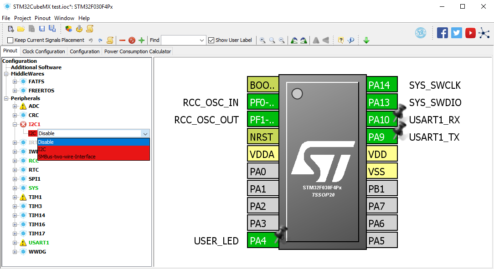

This is because the I2C pins are used by UART1 on PA10 and PA9. You can either try [switching them to alternative locations](../lesson1_serial_helloworld/alt_locations.md), so just disable the peripheral.

I'm going to disable it in this example. Simply left click on PA10 and PA9 and change their function to `Reset_State`:

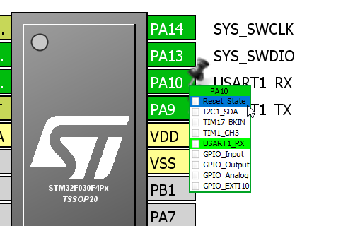

We can enable I2C now after both of them are freed:

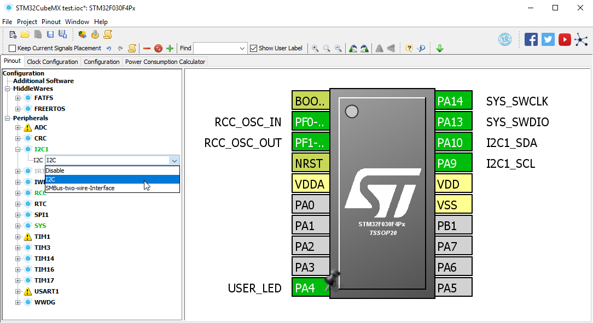

Go to `Configuration` page and click on the newly appeared `I2C1` button to configure it:

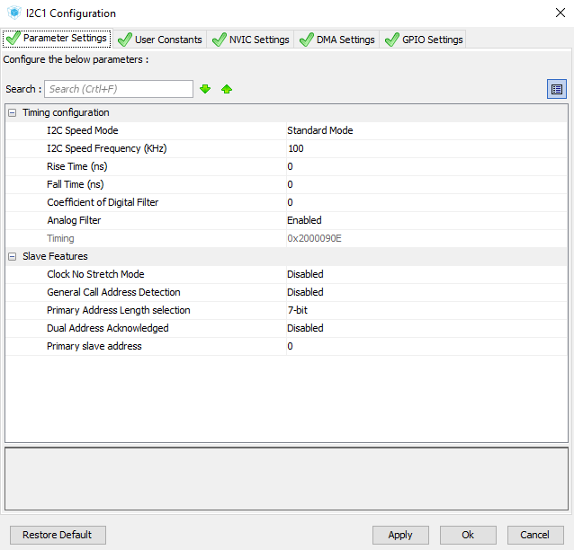

`I2C Speed Mode` and `I2C Speed Frequency` depend on the device you're using, read the datasheet to see what it needs.

There are also some fancy adjustable timing parameters, leave them at default if you don't know what you're doing.

Regenerate the code and launch Keil MDK.

### Using I2C

I sure hope I've hammered the idea home by now. You should go straight to provided library file to see what you can use.

A bunch of functions are provided near the end of [stm32f0xx_hal_i2c.h](sample_code_i2c/Drivers/STM32F0xx_HAL_Driver/Inc/stm32f0xx_hal_i2c.h):

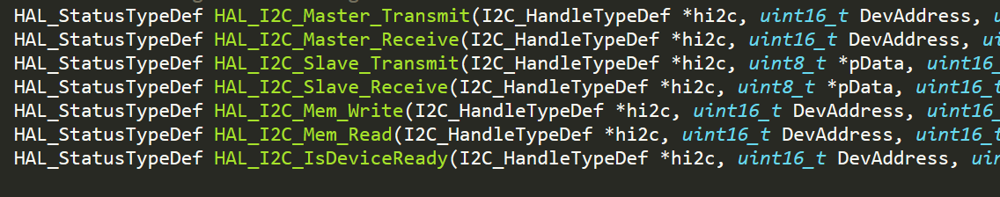

Generally, you use `HAL_I2C_IsDeviceReady()` to see if a device is on the I2C bus, then use `HAL_I2C_Master_Transmit()` and `HAL_I2C_Master_Receive()` to read or write to them. 

`HAL_I2C_Mem_Write()` and `HAL_I2C_Mem_Read()` are also available for reading and writing to a certain memory location.

Thanks to its relatively complicated signaling and protocol, a logic analyzer is your best bet when it comes to I2C debugging. 

The [sample project is here](./sample_code_spi), however I didn't have any I2C devices with me at the moment, there isn't a code example inside.

## Homeworks

You might have noticed that I didn't use any actual SPI and I2C devices while giving examples above. There are just too many of them and every application is different. However if you do have a SPI or I2C peripheral chip why not use what you learned above to try to get it to work?

Again, it's very likely that things does not work at first, therefore it's really handy to have a logic analyzer to see what's exactly going on. They are very cheap ones on ebay, but you might want to get a good one and be done with it. The one I have is [Saleae Logic Pro 16](https://www.saleae.com/)

## Next Steps

In the next lesson we're going to look at the holy grail embedded development: Real-Time Operating System. 

Instead of running everything inside one big loop, with RTOS you can split your program into self-contained tasks that are executed in parallel. As a result, you can achieve much more sophisticated behavior while reducing the code complexity.

[CLICK ME TO GO TO NEXT LESSON](../lesson6_rtos/README.md)

## Questions?

If you have any questions, feel free to [open an issue](https://github.com/dekuNukem/stm32_the_easy_way/issues) or email me at `dekunukem gmail com`. The former is preferable since it helps other people too.
